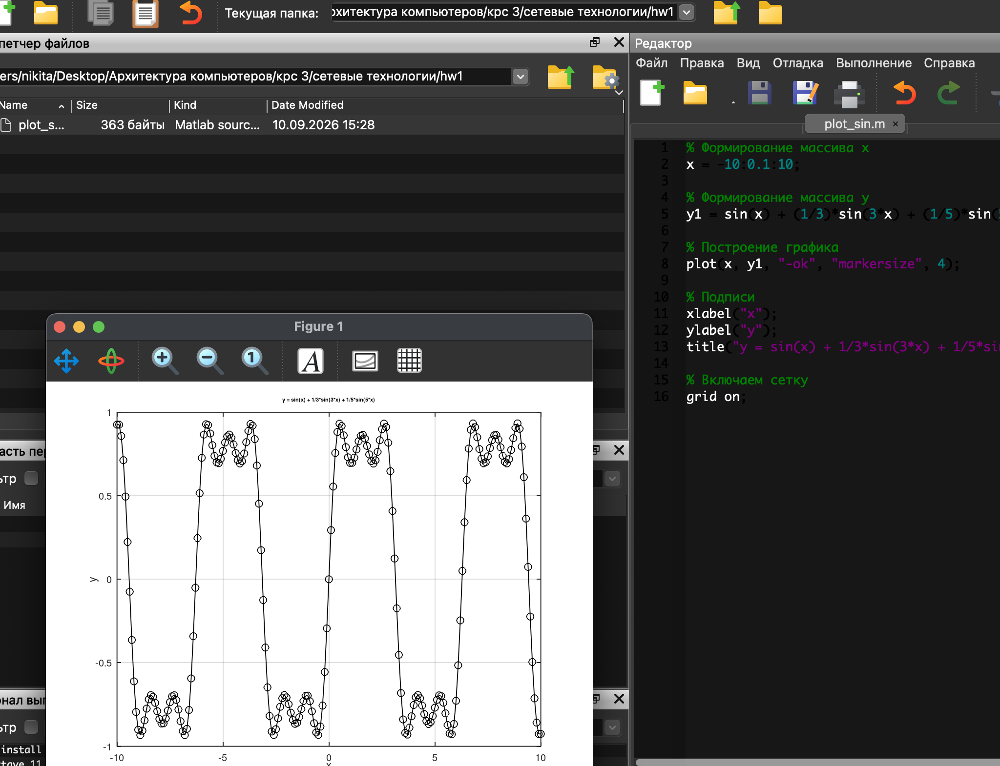
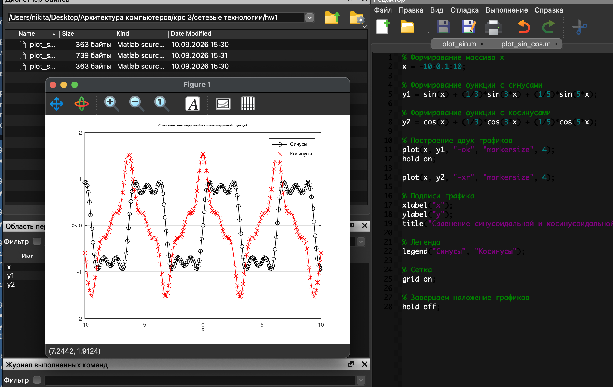
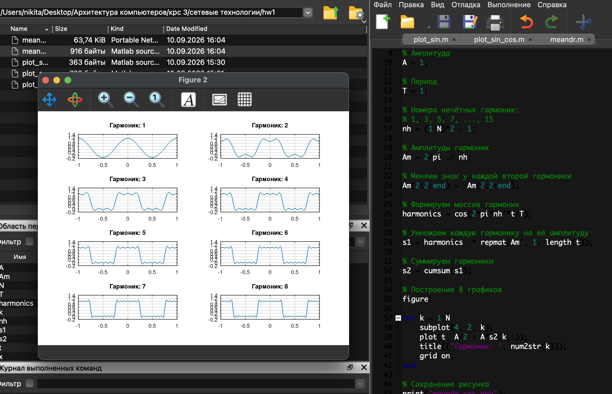
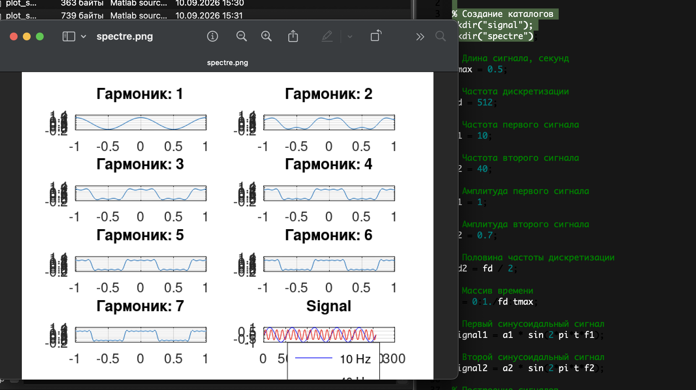
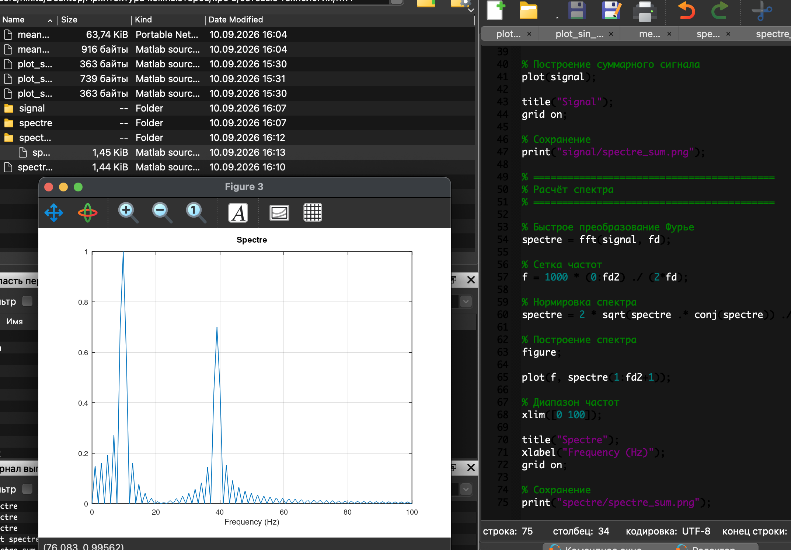
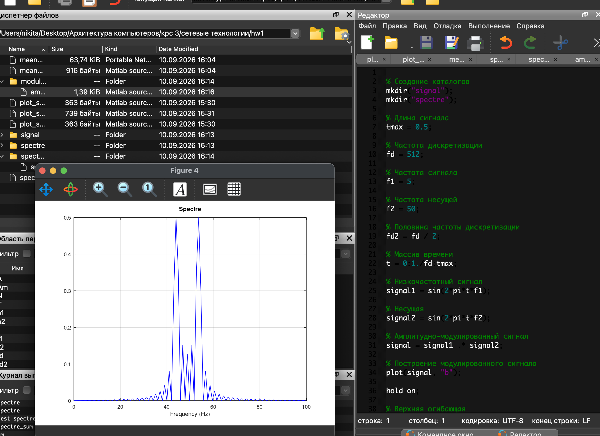

---
## Front matter
lang: ru-RU
title: Отчёт по выполнению лабораторной работы №1
subtitle: Работа с группами
author:
  - Коровкин Н. М.
institute:
  - Российский университет дружбы народов, Москва, Россия
date: 9 сентября 2026

## i18n babel
babel-lang: russian
babel-otherlangs: english

## Formatting pdf
toc: false
toc-title: Содержание
slide_level: 2
aspectratio: 169
section-titles: true
theme: metropolis
header-includes:
 - \metroset{progressbar=frametitle,sectionpage=progressbar,numbering=fraction}
 - '\makeatletter'
 - '\beamer@ignorenonframefalse'
 - '\makeatother'
 
## Fonts
mainfont: PT Serif
romanfont: PT Serif
sansfont: PT Sans
monofont: PT Mono
mainfontoptions: Ligatures=TeX
romanfontoptions: Ligatures=TeX
sansfontoptions: Ligatures=TeX,Scale=MatchLowercase
monofontoptions: Scale=MatchLowercase,Scale=0.9
---

# Информация

## Докладчик

:::::::::::::: {.columns align=center}
::: {.column width="70%"}

  * Коровкин Никита Михайлович
  * Студент
  * Российский университет дружбы народов
  * [1132246835@pfur.ru](mailto:1132246835@pfur.ru)

:::
::: {.column width="30%"}

:::
::::::::::::::

## Цель работы

Изучить методы кодирования и модуляции сигналов с помощью высокоуровневого языка программирования Octave, определить спектр и параметры сигналов, продемонстрировать принцип аналоговой амплитудной модуляции и исследовать свойство самосинхронизации различных способов кодирования.

## Задание

В ходе выполнения лабораторной работы необходимо:

построить график функции y = sin(x) + 1/3 sin(3x) + 1/5 sin(5x) на интервале [-10; 10];

добавить на один график функцию y = cos(x) + 1/3 cos(3x) + 1/5 cos(5x);

получить графики меандра при различном количестве гармоник и повторить построение через синусы;

определить спектры двух синусоидальных сигналов с частотами 10 и 40 Гц;

скорректировать спектры с учётом отрицательных частот и нормировки;

определить спектр суммы двух сигналов;

выполнить моделирование аналоговой амплитудной модуляции;

реализовать униполярное, AMI, NRZ, RZ, манчестерское и дифференциальное манчестерское кодирование;

исследовать свойство самосинхронизации кодов;

построить спектры полученных кодированных сигналов.

## Выполнение лабораторной работы

Построение графика синусоидальной функции
В первом задании был создан сценарий plot_sin.m. В нём сформирован массив значений x от -10 до 10 с шагом 0.1, после чего вычислена функция:

y = sin(x) + 1/3 sin(3x) + 1/5 sin(5x)(рис. [-@fig:001]).

{#fig:01 width=70%}

## Выполнение лабораторной работы

Построение синусоидальной и косинусоидальной функций
Следующим этапом к исходному графику была добавлена функция:

y2 = cos(x) + 1/3 cos(3x) + 1/5 cos(5x)
Обе функции были построены в одной системе координат с использованием hold on.(рис. [-@fig:002]).

{#fig:02 width=70%}

## Выполнение лабораторной работы

Разложение меандра в частичный ряд Фурье
Для исследования разложения импульсного сигнала был создан файл meandr.m. В качестве количества гармоник было выбрано N = 8, амплитуда A = 1, период T = 1.(рис. [-@fig:003]).

{#fig:03 width=70%}

## Выполнение лабораторной работы

Определение спектров двух синусоидальных сигналов
Для исследования спектра были созданы два сигнала:

частота первого сигнала f1 = 10 Гц, амплитуда a1 = 1;

частота второго сигнала f2 = 40 Гц, амплитуда a2 = 0.7;

частота дискретизации fd = 512 Гц;

длительность сигнала tmax = 0.5 с.

Сигналы задавались выражениями:

signal1 = a1*sin(2*pi*t*f1);
signal2 = a2*sin(2*pi*t*f2);
Сначала были построены временные графики двух сигналов.(рис. [-@fig:004]).

{#fig:04 width=70%}

## Выполнение лабораторной работы

По заданным битовым последовательностям я получил кодированные сигналы для нескольких кодов(рис. [-@fig:005]).

{#fig:05 width=70%}

## Выполнение лабораторной работы

Следующие графики(рис. [-@fig:006]).

{#fig:06 width=70%}

---

## Выводы

В ходе лабораторной работы были изучены основные методы представления, кодирования и модуляции сигналов в GNU Octave.

## Список литературы{.unnumbered}

::: {#refs}
:::
