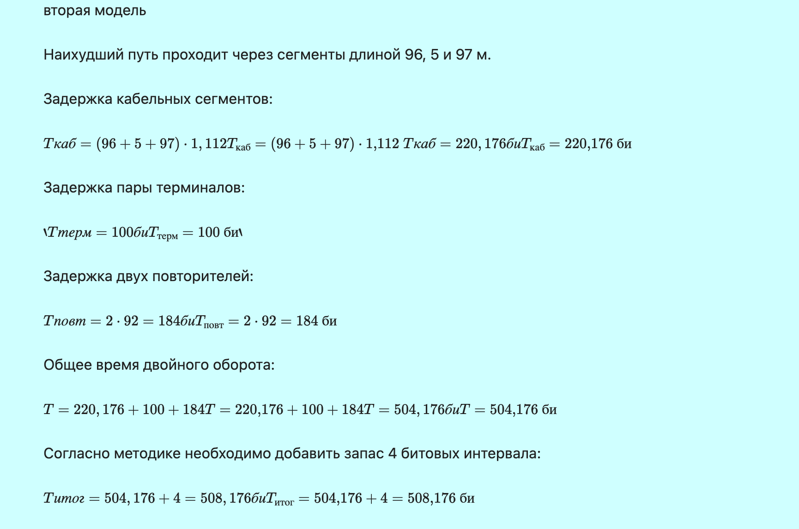

---
## Front matter
lang: ru-RU
title: Отчёт по выполнению домашней работы №2
subtitle: Работа с группами
author:
  - Коровкин Н. М.
institute:
  - Российский университет дружбы народов, Москва, Россия
date: 16 сентября 2026

## i18n babel
babel-lang: russian
babel-otherlangs: english

## Formatting pdf
toc: false
toc-title: Содержание
slide_level: 2
aspectratio: 169
section-titles: true
theme: metropolis
header-includes:
 - \metroset{progressbar=frametitle,sectionpage=progressbar,numbering=fraction}
 - '\makeatletter'
 - '\beamer@ignorenonframefalse'
 - '\makeatother'
 
## Fonts
mainfont: PT Serif
romanfont: PT Serif
sansfont: PT Sans
monofont: PT Mono
mainfontoptions: Ligatures=TeX
romanfontoptions: Ligatures=TeX
sansfontoptions: Ligatures=TeX,Scale=MatchLowercase
monofontoptions: Scale=MatchLowercase,Scale=0.9
---

# Информация

## Докладчик

:::::::::::::: {.columns align=center}
::: {.column width="70%"}

  * Коровкин Никита Михайлович
  * Студент
  * Российский университет дружбы народов
  * [1132246835@pfur.ru](mailto:1132246835@pfur.ru)

:::
::: {.column width="30%"}

:::
::::::::::::::

## Цель работы

Цель данной работы— изучение принципов технологий Ethernet и Fast Ethernet
и практическое освоение методик оценки работоспособности сети, построенной
на базе технологии Fast Ethernet.

## Задание

Требуется оценить работоспособность 100-мегабитной сети Fast Ethernet в соответствии с первой и второй моделями.

## Выполнение лабораторной работы

Fast Ethernet представляет собой технологию передачи данных со скоростью **100 Мбит/с**. В рассматриваемой работе используется стандарт **100BASE-TX**, использующий витую пару.

Для Fast Ethernet битовый интервал составляет **0,01 мкс**. Формат кадра и механизм доступа к среде передачи сохраняются по сравнению с Ethernet.

В рассматриваемой сети используются два повторителя класса II. Согласно первой модели Fast Ethernet, при двух повторителях класса II максимально допустимый диаметр домена коллизий для сети с TX-сегментами составляет **205 м**.

Вторая модель основана на расчёте времени двойного оборота сигнала. Полученное значение с учётом дополнительного запаса в 4 битовых интервала должно быть не более **512 битовых интервалов**.

## Выполнение лабораторной работы

 Посчитаем диаметр домена коллизий (рис. [-@fig:001]).

{#fig:01 width=70%}

## Выполнение лабораторной работы

теперь посчитаем время двойного оборота(рис. [-@fig:002]).

{#fig:02 width=70%}

## Выполнение лабораторной работы

Итоговые результаты подсчета(рис. [-@fig:003]).

{#fig:03 width=70%}

## Выводы

В ходе лабораторной работы была рассмотрена сеть Fast Ethernet стандарта 100BASE-TX с двумя повторителями класса II. Для выбранной конфигурации был определён диаметр домена коллизий и рассчитано время двойного оборота сигнала.

## Список литературы{.unnumbered}

::: {#refs}
:::
