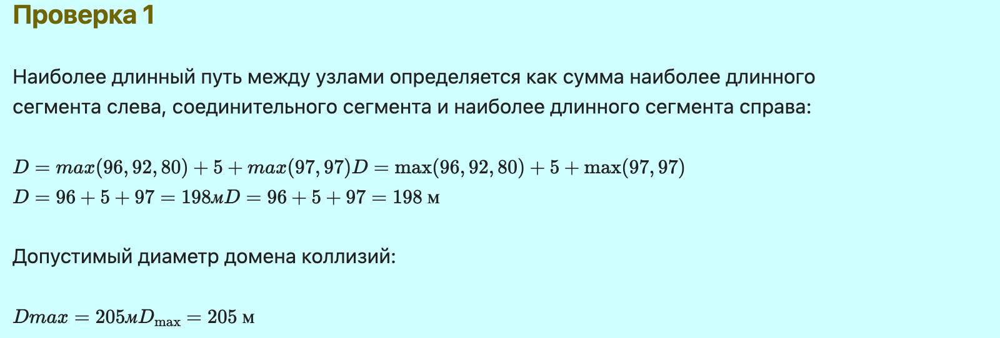
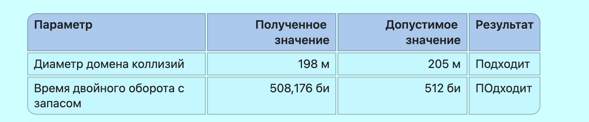

---
## Front matter
title: "Лабораторная работа №2"
subtitle: "Отчёт"
author: "Коровкин Никита Михайлович"

## Generic otions
lang: ru-RU
toc-title: "Содержание"

## Bibliography
bibliography: bib/cite.bib
csl: pandoc/csl/gost-r-7-0-5-2008-numeric.csl

## Pdf output format
toc: true # Table of contents
toc-depth: 2
lof: true # List of figures
lot: true # List of tables
fontsize: 12pt
linestretch: 1.5
papersize: a4
documentclass: scrreprt
## I18n polyglossia
polyglossia-lang:
  name: russian
  options:
	- spelling=modern
	- babelshorthands=true
polyglossia-otherlangs:
  name: english
## I18n babel
babel-lang: russian
babel-otherlangs: english
## Fonts
mainfont: PT Serif
romanfont: PT Serif
sansfont: PT Sans
monofont: PT Mono
mainfontoptions: Ligatures=TeX
romanfontoptions: Ligatures=TeX
sansfontoptions: Ligatures=TeX,Scale=MatchLowercase
monofontoptions: Scale=MatchLowercase,Scale=0.9
## Biblatex
biblatex: true
biblio-style: "gost-numeric"
biblatexoptions:
  - parentracker=true
  - backend=biber
  - hyperref=auto
  - language=auto
  - autolang=other*
  - citestyle=gost-numeric
## Pandoc-crossref LaTeX customization
figureTitle: "Рис."
tableTitle: "Таблица"
listingTitle: "Листинг"
lofTitle: "Список иллюстраций"
lotTitle: "Список таблиц"
lolTitle: "Листинги"
## Misc options
indent: true
header-includes:
  - \usepackage{indentfirst}
  - \usepackage{float} # keep figures where there are in the text
  - \floatplacement{figure}{H} # keep figures where there are in the text
---

# Цель работы

Цель данной работы— изучение принципов технологий Ethernet и Fast Ethernet
и практическое освоение методик оценки работоспособности сети, построенной
на базе технологии Fast Ethernet.

# Задание

Требуется оценить работоспособность 100-мегабитной сети Fast Ethernet в соответствии с первой и второй моделями.

# Выполнение лабораторной работы

Fast Ethernet представляет собой технологию передачи данных со скоростью **100 Мбит/с**. В рассматриваемой работе используется стандарт **100BASE-TX**, использующий витую пару.

Для Fast Ethernet битовый интервал составляет **0,01 мкс**. Формат кадра и механизм доступа к среде передачи сохраняются по сравнению с Ethernet.

В рассматриваемой сети используются два повторителя класса II. Согласно первой модели Fast Ethernet, при двух повторителях класса II максимально допустимый диаметр домена коллизий для сети с TX-сегментами составляет **205 м**.

Вторая модель основана на расчёте времени двойного оборота сигнала. Полученное значение с учётом дополнительного запаса в 4 битовых интервала должно быть не более **512 битовых интервалов**.

 Посчитаем диаметр домена коллизий (рис. [-@fig:001]).

{#fig:01 width=70%}

теперь посчитаем время двойного оборота(рис. [-@fig:002]).

{#fig:02 width=70%}

Итоговые результаты подсчета(рис. [-@fig:003]).

{#fig:03 width=70%}

# Выводы

В ходе лабораторной работы была рассмотрена сеть Fast Ethernet стандарта 100BASE-TX с двумя повторителями класса II. Для выбранной конфигурации был определён диаметр домена коллизий и рассчитано время двойного оборота сигнала.

# Список литературы{.unnumbered}

::: {#refs}
:::
