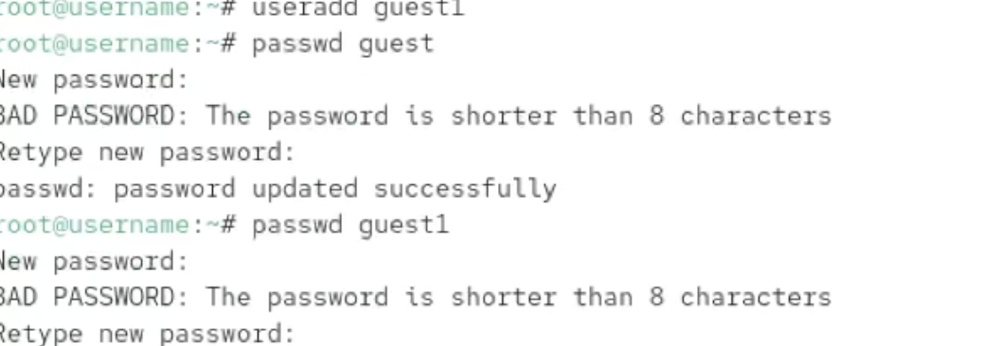
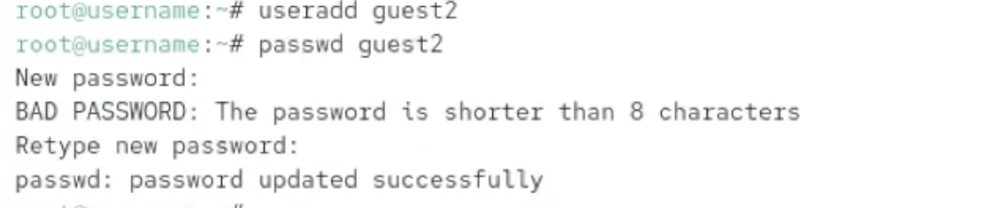
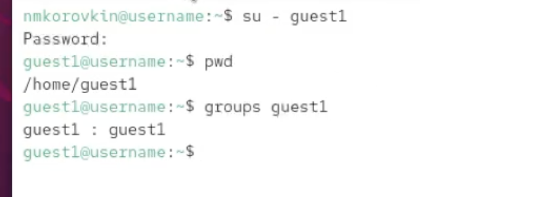
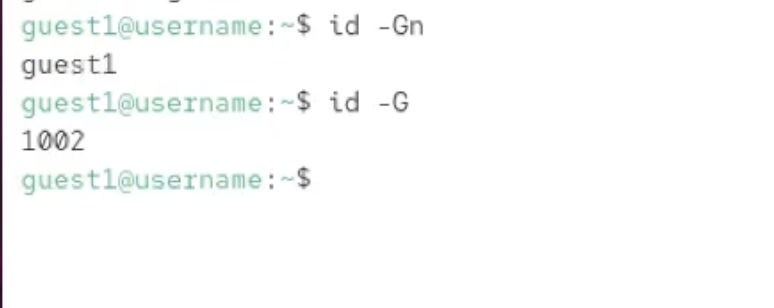
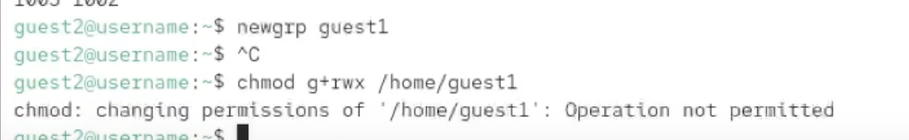
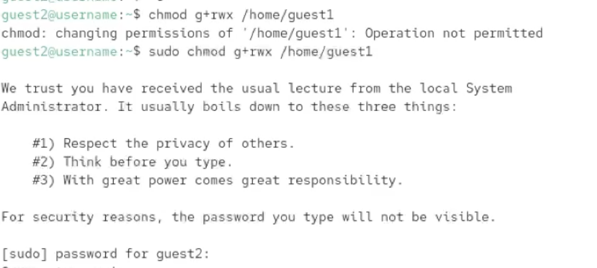
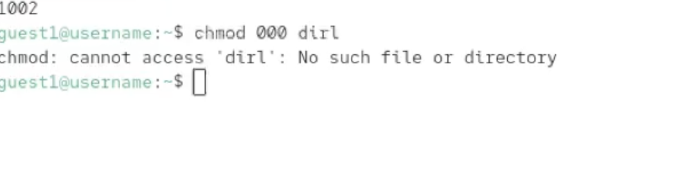
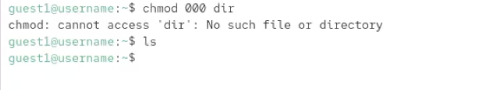

---
## Front matter
title: "Лабораторная работа №3"
subtitle: "Отчёт"
author: "Коровкин Никита Михайлович"

## Generic otions
lang: ru-RU
toc-title: "Содержание"

## Bibliography
bibliography: bib/cite.bib
csl: pandoc/csl/gost-r-7-0-5-2008-numeric.csl

## Pdf output format
toc: true # Table of contents
toc-depth: 2
lof: true # List of figures
lot: true # List of tables
fontsize: 12pt
linestretch: 1.5
papersize: a4
documentclass: scrreprt
## I18n polyglossia
polyglossia-lang:
  name: russian
  options:
	- spelling=modern
	- babelshorthands=true
polyglossia-otherlangs:
  name: english
## I18n babel
babel-lang: russian
babel-otherlangs: english
## Fonts
mainfont: PT Serif
romanfont: PT Serif
sansfont: PT Sans
monofont: PT Mono
mainfontoptions: Ligatures=TeX
romanfontoptions: Ligatures=TeX
sansfontoptions: Ligatures=TeX,Scale=MatchLowercase
monofontoptions: Scale=MatchLowercase,Scale=0.9
## Biblatex
biblatex: true
biblio-style: "gost-numeric"
biblatexoptions:
  - parentracker=true
  - backend=biber
  - hyperref=auto
  - language=auto
  - autolang=other*
  - citestyle=gost-numeric
## Pandoc-crossref LaTeX customization
figureTitle: "Рис."
tableTitle: "Таблица"
listingTitle: "Листинг"
lofTitle: "Список иллюстраций"
lotTitle: "Список таблиц"
lolTitle: "Листинги"
## Misc options
indent: true
header-includes:
  - \usepackage{indentfirst}
  - \usepackage{float} # keep figures where there are in the text
  - \floatplacement{figure}{H} # keep figures where there are in the text
---
# Цель работы

Получение практических навыков работы в консоли с атрибутами файлов для групп пользователей, закрепление знаний о коллективном доступе в ОС Linux.

# Задание

1. Создать учетные записи пользователей `guest` и `guest2`.
2. Добавить `guest2` в группу `guest`.
3. Отработать вход в систему под разными пользователями одновременно.
4. Проанализировать членство в группах через команды `id`, `groups` и файл `/etc/group`.
5. Изучить работу команды `newgrp`.
6. Отработать изменение прав доступа для группы на домашнюю директорию и поддиректории.

# Выполнение лабораторной работы

Сначала, используя права администратора (root), создаем двух пользователей: `guest` и `guest2`. Для каждого из них устанавливаем пароли, чтобы иметь возможность авторизоваться в системе под их учетными записями (рис. [-@fig:001]).

{#fig:01 width=70%}

Для настройки коллективного доступа добавляем пользователя `guest2` в группу `guest`. Это позволит нам в дальнейшем тестировать права доступа внутри одной группы (рис. [-@fig:002]).

{#fig:02 width=70%}

Открываем две консоли (или два окна терминала) и входим в систему под обоими пользователями одновременно. Проверяем текущее местоположение с помощью `pwd` — каждый пользователь оказывается в своей домашней директории (рис. [-@fig:003]).

{#fig:03 width=70%}

Проводим сравнительный анализ команд для проверки групп. Используем `groups` и `id` с различными флагами (`-Gn`, `-G`). Убеждаемся, что для `guest2` в списке групп теперь значится и группа `guest` (рис. [-@fig:004]).

{#fig:04 width=70%}

Проверяем системный файл `/etc/group`. Находим в нем записи о созданных пользователях и убеждаемся, что изменения, внесенные через `gpasswd`, корректно отображаются в конфигурации системы (рис. [-@fig:005]).

{#fig:05 width=70%}

От имени `guest2` выполняем команду `newgrp guest`. Эта команда позволяет временно сменить основную группу пользователя на указанную, что влияет на права создаваемых в этой сессии файлов (рис. [-@fig:006]).

{#fig:06 width=70%}

Теперь от имени пользователя `guest` расширяем права на его домашнюю директорию, разрешая группе `guest` (в которой состоит `guest2`) чтение, запись и выполнение. Проверяем изменения командой `ls -ld` (рис. [-@fig:007]).

{#fig:07 width=70%}

В завершение, от имени `guest` создаем (если не была создана ранее) поддиректорию `dir1` и снимаем с нее абсолютно все атрибуты доступа. Это демонстрирует, как запрет на уровне владельца влияет на доступ даже для участников группы с расширенными правами (рис. [-@fig:008]).

{#fig:08 width=70%}

# Выводы

В ходе работы были изучены механизмы группового взаимодействия в ОС Linux. Мы научились управлять составом групп, переключаться между ними в рамках активной сессии и настраивать права доступа так, чтобы разрешать или ограничивать совместную работу пользователей над файлами в общих директориях.

# Список литературы{.unnumbered}

::: {#refs}
:::
