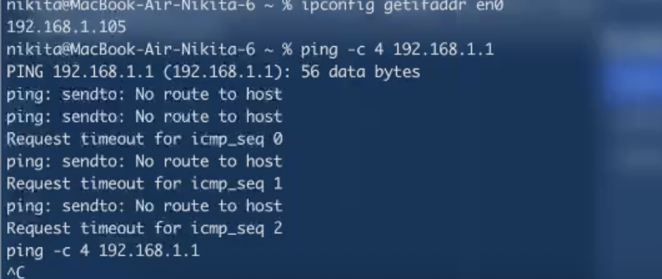
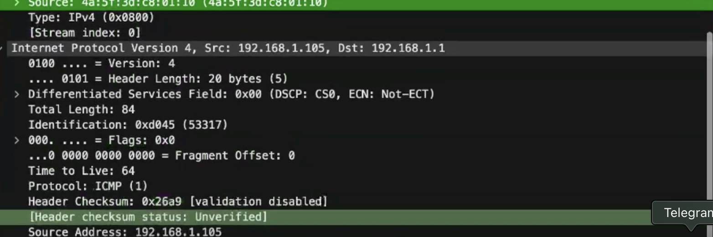
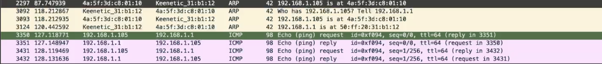
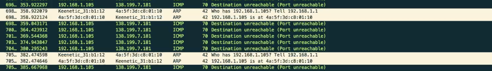
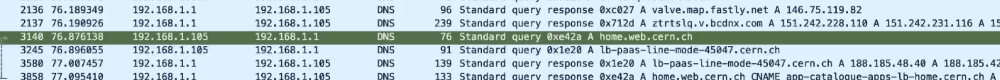
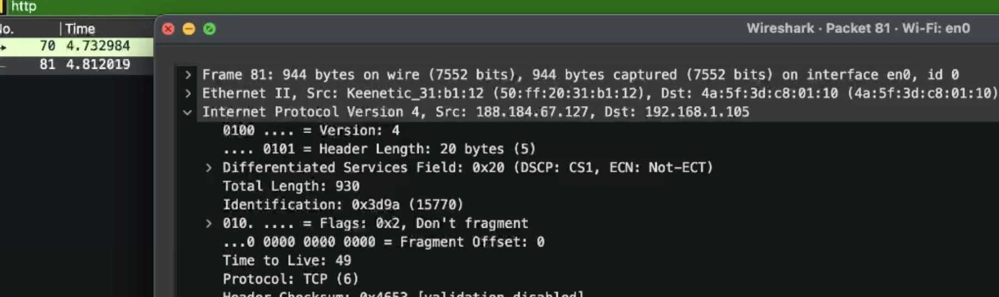
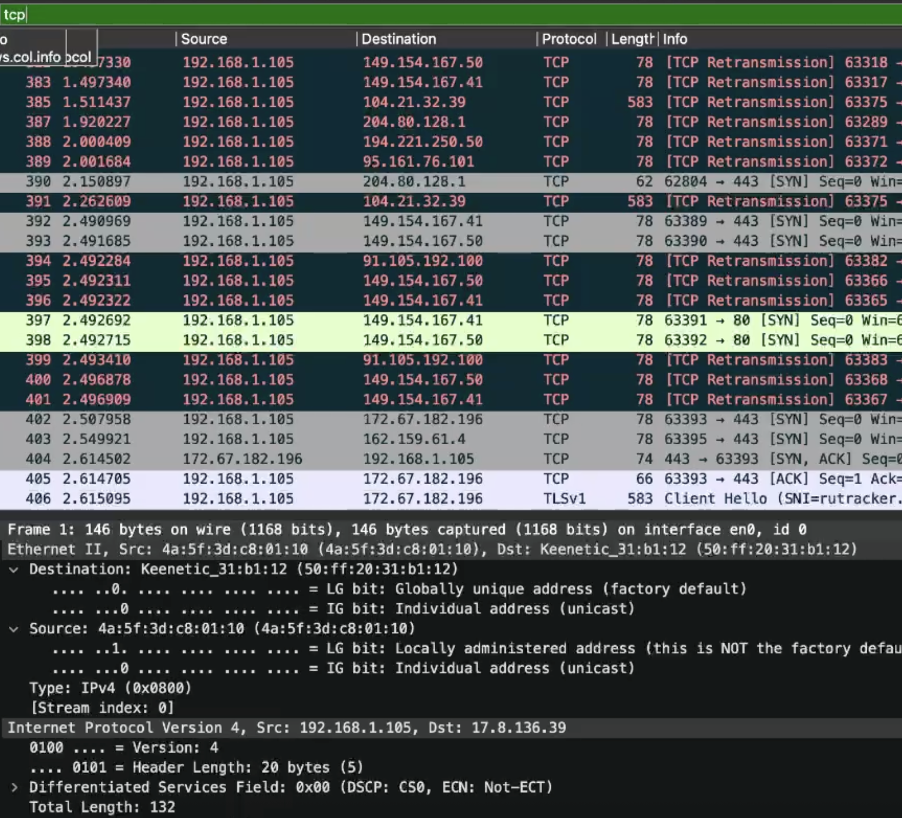
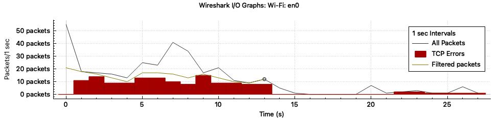

---
## Front matter
title: "Домашняя работа №3"
subtitle: "Отчёт"
author: "Коровкин Никита Михайлович"

## Generic otions
lang: ru-RU
toc-title: "Содержание"

## Bibliography
bibliography: bib/cite.bib
csl: pandoc/csl/gost-r-7-0-5-2008-numeric.csl

## Pdf output format
toc: true # Table of contents
toc-depth: 2
lof: true # List of figures
lot: true # List of tables
fontsize: 12pt
linestretch: 1.5
papersize: a4
documentclass: scrreprt
## I18n polyglossia
polyglossia-lang:
  name: russian
  options:
	- spelling=modern
	- babelshorthands=true
polyglossia-otherlangs:
  name: english
## I18n babel
babel-lang: russian
babel-otherlangs: english
## Fonts
mainfont: PT Serif
romanfont: PT Serif
sansfont: PT Sans
monofont: PT Mono
mainfontoptions: Ligatures=TeX
romanfontoptions: Ligatures=TeX
sansfontoptions: Ligatures=TeX,Scale=MatchLowercase
monofontoptions: Scale=MatchLowercase,Scale=0.9
## Biblatex
biblatex: true
biblio-style: "gost-numeric"
biblatexoptions:
  - parentracker=true
  - backend=biber
  - hyperref=auto
  - language=auto
  - autolang=other*
  - citestyle=gost-numeric
## Pandoc-crossref LaTeX customization
figureTitle: "Рис."
tableTitle: "Таблица"
listingTitle: "Листинг"
lofTitle: "Список иллюстраций"
lotTitle: "Список таблиц"
lolTitle: "Листинги"
## Misc options
indent: true
header-includes:
  - \usepackage{indentfirst}
  - \usepackage{float} # keep figures where there are in the text
  - \floatplacement{figure}{H} # keep figures where there are in the text
---
# Цель работы

Изучение посредством Wireshark кадров Ethernet, анализ PDU протоколов
транспортного и прикладного уровней стека TCP/IP.

# Задание

1. Изучение возможностей команды ipconfig для ОС типа Windows (ifconfig
для систем типа Linux).
2. Определение MAC-адреса устройства и его типа
3. Установить на домашнем устройстве Wireshark.
4. С помощью Wireshark захватить и проанализировать пакеты ARP и ICMP
в части кадров канального уровня.
5. С помощью Wireshark захватить и проанализировать пакеты HTTP, DNS в части заголовков и информации протоколов TCP, UDP, QUIC.
6. С помощью Wireshark проанализировать handshake протокола TCP

# Выполнение лабораторной работы

Для получения информации о сетевых интерфейсах на компьютере была использована команда ifconfig. Поле ether содержит MAC-адрес сетевого интерфейса. Поле inet содержит IPv4-адрес устройства. Поле netmask определяет маску подсети, а broadcast содержит широковещательный адрес сети. Далее я узнал непосредственно Айпи адрес и адрес шлюза.(рис. [-@fig:001]).

{#fig:001 width=70%}

Затем я определил мак адрес шлюза.(рис. [-@fig:002]).

{#fig:002 width=70%}

MAC-адрес представляет собой 48-битный адрес, записываемый в шестнадцатеричной системе счисления в виде шести байтов.
50:ff:20:31:b1:12
Первые три байта MAC-адреса образуют OUI (Organizationally Unique Identifier). Эта часть адреса используется для идентификации организации или производителя, которому выделен соответствующий диапазон MAC-адресов.

Последние три байта используются для идентификации конкретного сетевого интерфейса в соответствующем диапазоне адресов

В моем случае мак адрес индивидуальный, глобально администрируемым.

Для анализа сетевого трафика была запущена программа Wireshark.

В качестве интерфейса для захвата был выбран активный сетевой интерфейс eth0(рис. [-@fig:003]).

{#fig:003 width=70%}

После запуска захвата в Wireshark [@wireshark_doc] начали отображаться передаваемые сетевые пакет.

ля генерации ICMP-трафика был выполнен запрос на свой же адрес.
Команда ping отправляет ICMP Echo Request на указанный IP-адрес и ожидает получения ICMP Echo Reply.(рис. [-@fig:004]).

{#fig:004 width=70%}

В результате были получены ответы от шлюза, что подтверждает его доступность.

После завершения захвата в Wireshark был применён фильтр:
arp or icmp
Фильтр оставляет в списке только пакеты протоколов ARP и ICMP.В результате были получены ответы от шлюза, что подтверждает его доступность.(рис. [-@fig:005]).

{#fig:005 width=70%}

В захваченном трафике был выбран пакет ICMP Echo Request, сформированный в результате выполнения команды ping.

В структуре пакета был исследован заголовок Ethernet II(рис. [-@fig:006]).

{#fig:006 width=70%}

MAC-адрес источника соответствует сетевому интерфейсу компьютера, поскольку именно компьютер сформировал ICMP-запрос.

MAC-адрес назначения соответствует сетевому интерфейсу шлюза, поскольку пакет передаётся маршрутизатору.
В поле Type заголовка Ethernet II указывается протокол сетевого уровня, переносимый данным Ethernet-кадром. Для IPv4 используется значение 0x0800.

Следующим был исследован ICMP Echo Reply - ответ на отправленный ранее Echo Request.(рис. [-@fig:007]).

{#fig:007 width=70%}

В данном случае MAC-адреса источника и назначения поменялись местами по сравнению с Echo Request.

Это объясняется направлением передачи данных: ответ отправляется от шлюза обратно к компьютеру.

## Анализ ARP

ARP (Address Resolution Protocol) используется для определения MAC-адреса устройства по известному IPv4-адресу в пределах локальной сети.
При необходимости передачи пакета шлюзу компьютер должен знать не только его IP-адрес, но и MAC-адрес.
Для этого используется ARP Request.
В Ethernet II заголовке ARP-запроса в качестве MAC-адреса назначения обычно используется:
ff:ff:ff:ff:ff:ff
Это широковещательный MAC-адрес.

Он означает, что Ethernet-кадр должен быть доставлен всем устройствам соответствующего локального сегмента.

Для ARP Request поле Opcode имеет значение request.
Для ARP Reply оно имеет значение reply.(рис. [-@fig:008]).

{#fig:008 width=70%}

Для дополнительного исследования был начат новый захват трафика.

В командной строке была выполнена команда: ping -c 4 rudn.ru
После этого захват был остановлен и применён фильтр: arp or icmp
При обращении к удалённому узлу сначала необходимо определить его IP-адрес по доменному имени. После определения IP-адреса ICMP-пакеты передаются через шлюз по умолчанию.(рис. [-@fig:009]).

{#fig:009 width=70%}

Для анализа HTTP был начат новый захват трафика.

В браузере был открыт ресурс:

http://info.cern.ch/
Данный ресурс использует протокол HTTP.

После открытия страницы в Wireshark был применён фильтр: http
В результате были обнаружены HTTP-пакеты.
HTTP работает поверх TCP. Поэтому при анализе HTTP-пакета также можно исследовать TCP-заголовок.
В TCP-заголовке были рассмотрены:

* порт источника;
* порт назначения;
* Sequence Number;
* Acknowledgment Number;
* TCP Flags;
* Window Size;
* TCP Options.(рис. [-@fig:010]).

{#fig:010 width=70%}

Для анализа DNS был использован фильтр dns.DNS используется для преобразования доменных имён в IP-адреса.

Например, перед установлением соединения с сервером по доменному имени клиенту необходимо определить IP-адрес соответствующего сервера.
В DNS-запросе указывается имя узла, для которого необходимо получить сетевой адрес.
DNS обычно использует UDP, поэтому в захваченном пакете присутствует заголовок UDP.(рис. [-@fig:011]).

{#fig:011 width=70%}

Для исследования протокола QUIC был выполнен захват соответствующего сетевого трафика.
QUIC является транспортным протоколом, работающим поверх UDP.

Упрощённая структура передачи имеет вид

HTTP/3
   ↓
 QUIC
   ↓
 UDP
   ↓
 IP
   ↓
 Ethernet/Wi-Fi
В отличие от классической схемы HTTP поверх TCP, QUIC использует UDP в качестве основы транспортной передачи.

При анализе пакета были исследованы сведения о QUIC-соединении и содержащиеся в нём поля.(рис. [-@fig:012]).

{#fig:012 width=70%}

Для исследования механизма установления TCP-соединения был выполнен новый захват трафика.
В Wireshark были исследованы TCP-пакеты, относящиеся к установлению соединения.
Для поиска пакетов с флагом SYN использовался фильтр - tcp.flags.syn == 1(рис. [-@fig:013]).

{#fig:013 width=70%}

Для дополнительного анализа TCP-соединения в Wireshark был использован граф потока.

Граф позволяет визуально представить направление передачи TCP-сегментов между клиентом и сервером.(рис. [-@fig:014]).

{#fig:014 width=70%}

# Выводы

В ходе лабораторной работы были изучены основные средства получения информации о сетевых параметрах компьютера с помощью командной строки.

# Список литературы{.unnumbered}

::: {#refs}
:::
