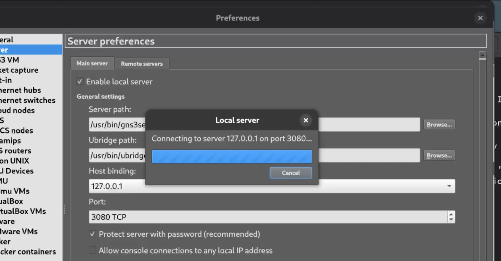
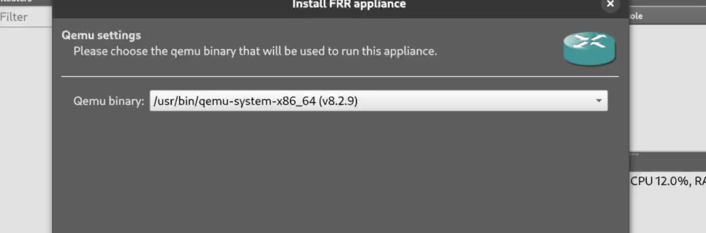
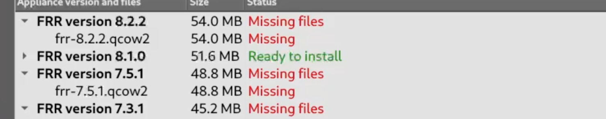

---
## Front matter
lang: ru-RU
title: Отчёт по выполнению лабораторной работы №1
subtitle: Работа с группами
author:
  - Коровкин Н. М.
institute:
  - Российский университет дружбы народов, Москва, Россия
date: 9 сентября 2026

## i18n babel
babel-lang: russian
babel-otherlangs: english

## Formatting pdf
toc: false
toc-title: Содержание
slide_level: 2
aspectratio: 169
section-titles: true
theme: metropolis
header-includes:
 - \metroset{progressbar=frametitle,sectionpage=progressbar,numbering=fraction}
 - '\makeatletter'
 - '\beamer@ignorenonframefalse'
 - '\makeatother'
 
## Fonts
mainfont: PT Serif
romanfont: PT Serif
sansfont: PT Sans
monofont: PT Mono
mainfontoptions: Ligatures=TeX
romanfontoptions: Ligatures=TeX
sansfontoptions: Ligatures=TeX,Scale=MatchLowercase
monofontoptions: Scale=MatchLowercase,Scale=0.9
---

# Информация

## Докладчик

:::::::::::::: {.columns align=center}
::: {.column width="70%"}

  * Коровкин Никита Михайлович
  * Студент
  * Российский университет дружбы народов
  * [1132246835@pfur.ru](mailto:1132246835@pfur.ru)

:::
::: {.column width="30%"}

:::
::::::::::::::

## Задание

Установка и настройка GNS3 и сопутствующего программного обеспечения.

## Выполнение лабораторной работы

В методических материалах выполнение лабораторной работы рассматривается на Windows. В моём случае работа выполнялась на Linux, так как основной компьютер - MacBook Air с процессором Apple M2. Поэтому вместо установки GNS3 непосредственно на Windows была использована ранее созданная виртуальная машина с Fedora Linux.

Все дальнейшие действия выполнялись внутри Fedora VM: запуск GNS3, установка необходимых пакетов, добавление образов маршрутизаторов и проверка их работы. Такой вариант позволяет выполнить те же этапы лабораторной работы в Linux-среде(рис. [-@fig:001]).

После проверки системы были установлены GNS3 GUI, GNS3 Server и необходимые дополнительные компоненты. Также были установлены QEMU, libvirt, Telnet и другие инструменты, необходимые для дальнейшей работы.(рис. [-@fig:002]).

{#fig:02 width=70%}

## Выполнение лабораторной работы

После установки GNS3 был запущен из терминала командой:

gns3
При первом запуске был пройден Setup Wizard. В качестве способа запуска устройств был выбран локальный сервер, поскольку GNS3 Server уже работает непосредственно внутри Fedora.

Порт локального сервера 3080 был оставлен без изменений. После завершения настройки открылось основное окно GNS3. [-@fig:03]

{#fig:03 width=70%}

## Выполнение лабораторной работы

Следующим этапом было добавление маршрутизатора FRR (FRRouting).

В GNS3 был открыт раздел добавления маршрутизаторов, после чего через мастер установки был выбран FRR. Образ был установлен на локальный компьютер и настроен для работы через эмулятор QEMU.

После загрузки и импорта образа был создан шаблон FRR. В настройках шаблона была включена автоматическая генерация диска конфигурации.[-@fig:04]

{#fig:04 width=70%}

## Выполнение лабораторной работы

Для проверки работоспособности установленного образа был создан новый пустой проект GNS3 с названием PR-01.

В рабочую область был добавлен маршрутизатор FRR. После запуска устройства была открыта консоль, в которой появилось приглашение:

frr#
После этого была выполнена команда:

show version
Она позволила проверить версию установленного FRRouting.[-@fig:05]

{#fig:05 width=70%}

## Выполнение лабораторной работы

После проверки FRR аналогичная проверка была выполнена для VyOS.

В проект был добавлен маршрутизатор VyOS, после чего устройство было запущено и открыта его консоль.

show version
В результате была подтверждена версия VyOS 1.3.3.

{#fig:06 width=70%}

На рисунке [-@fig:06] показан запущенный маршрутизатор VyOS и результат проверки его версии.

---

## Выводы

Были установлены GNS3 и необходимые зависимости, добавлены и настроены шаблоны FRR и VyOS, отключён KVM для корректной работы в среде Apple Silicon, а также проверена работоспособность обоих маршрутизаторов.

## Список литературы{.unnumbered}

::: {#refs}
:::
