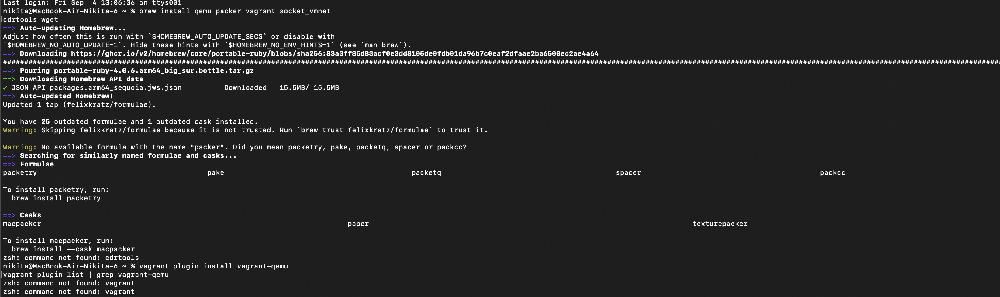
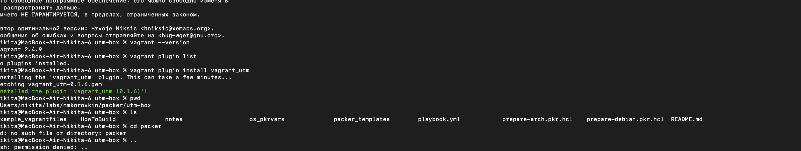
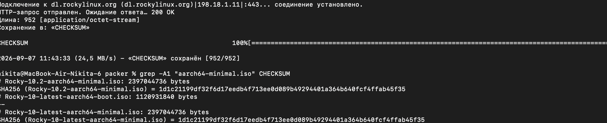
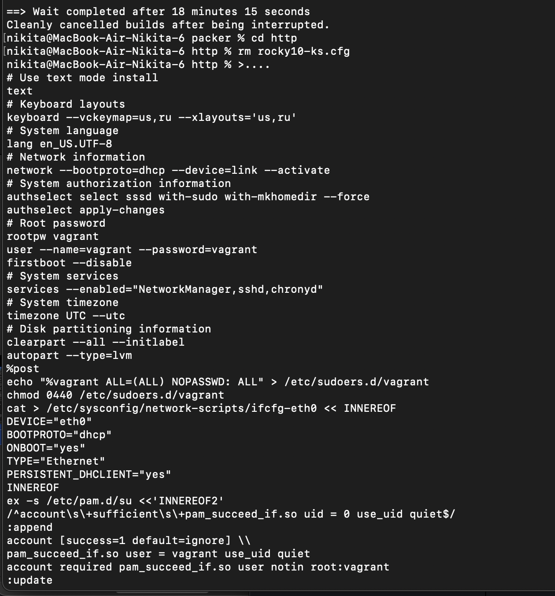
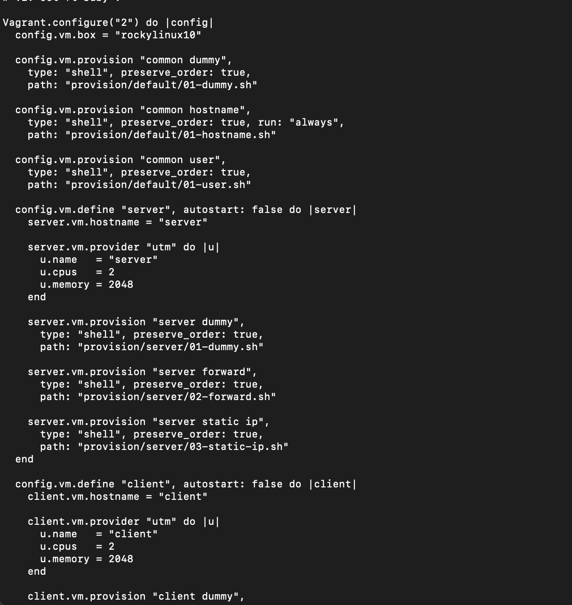
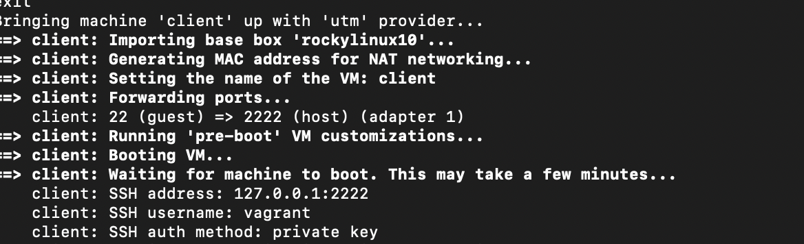
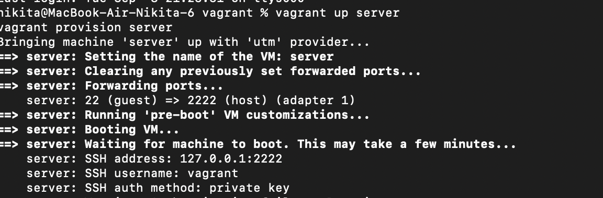

---
## Front matter
title: "Лабораторная работа №1"
subtitle: "Отчёт"
author: "Коровкин Никита Михайлович"

## Generic otions
lang: ru-RU
toc-title: "Содержание"

## Bibliography
bibliography: bib/cite.bib
csl: pandoc/csl/gost-r-7-0-5-2008-numeric.csl

## Pdf output format
toc: true # Table of contents
toc-depth: 2
lof: true # List of figures
lot: true # List of tables
fontsize: 12pt
linestretch: 1.5
papersize: a4
documentclass: scrreprt
## I18n polyglossia
polyglossia-lang:
  name: russian
  options:
	- spelling=modern
	- babelshorthands=true
polyglossia-otherlangs:
  name: english
## I18n babel
babel-lang: russian
babel-otherlangs: english
## Fonts
mainfont: PT Serif
romanfont: PT Serif
sansfont: PT Sans
monofont: PT Mono
mainfontoptions: Ligatures=TeX
romanfontoptions: Ligatures=TeX
sansfontoptions: Ligatures=TeX,Scale=MatchLowercase
monofontoptions: Scale=MatchLowercase,Scale=0.9
## Biblatex
biblatex: true
biblio-style: "gost-numeric"
biblatexoptions:
  - parentracker=true
  - backend=biber
  - hyperref=auto
  - language=auto
  - autolang=other*
  - citestyle=gost-numeric
## Pandoc-crossref LaTeX customization
figureTitle: "Рис."
tableTitle: "Таблица"
listingTitle: "Листинг"
lofTitle: "Список иллюстраций"
lotTitle: "Список таблиц"
lolTitle: "Листинги"
## Misc options
indent: true
header-includes:
  - \usepackage{indentfirst}
  - \usepackage{float} # keep figures where there are in the text
  - \floatplacement{figure}{H} # keep figures where there are in the text
---

# Цель работы

Получить практические навыки создания и управления виртуальными машинами с использованием Vagrant и UTM, собрать собственный Vagrant Box с операционной системой Rocky Linux при помощи Packer, настроить две виртуальные машины — сервер и клиент — и организовать между ними отдельную локальную сеть.

# Задание

В ходе выполнения лабораторной работы необходимо:

1. установить UTM, Vagrant и Packer;
2. подготовить образ Rocky Linux для архитектуры ARM64;
3. собрать Vagrant Box с использованием Packer;
4. зарегистрировать созданный Box в Vagrant;
5. создать конфигурацию Vagrant для виртуальных машин server и client;
6. запустить виртуальные машины;
7. настроить между виртуальными машинами приватную сеть;
8. назначить серверу статический IP-адрес;
9. проверить сетевое соединение между клиентом и сервером;
10. выполнить provision виртуальных машин.

# Выполнение лабораторной работы

1. Установка необходимого программного обеспечения

Для выполнения лабораторной работы на компьютере с macOS были установлены UTM, Packer и Vagrant. Для установки Packer и дополнительных инструментов использовался Homebrew.

Для установки UTM и Packer были выполнены команды:

brew install --cask utm
brew install packer wget
Vagrant устанавливался с использованием официального установщика. После установки Vagrant был подключён провайдер vagrant_utm:

vagrant plugin install vagrant_utm
После установки была выполнена проверка наличия плагина:

vagrant plugin list | grep vagrant_utm
Провайдер vagrant_utm позволяет Vagrant управлять виртуальными машинами непосредственно через UTM. В отличие от варианта с vagrant-qemu, созданные виртуальные машины отображаются в графическом интерфейсе UTM.(рис. [-@fig:001]).

{#fig:01 width=70%}

2. Подготовка рабочего каталога и образа Rocky Linux

Для лабораторной работы была создана структура каталогов проекта:

mkdir -p ~/labs/user_name/packer/http
mkdir -p ~/labs/user_name/vagrant/provision/default
mkdir -p ~/labs/user_name/vagrant/provision/server
mkdir -p ~/labs/user_name/vagrant/provision/client
После этого был выполнен переход в каталог Packer:

cd ~/labs/user_name/packer
Для виртуальных машин Apple Silicon необходимо использовать образ Rocky Linux архитектуры AArch64 (ARM64). Поэтому был загружен минимальный ISO-образ Rocky Linux 10.1 для AArch64, а также файл CHECKSUM:

wget https://dl.rockylinux.org/pub/rocky/10/isos/aarch64/Rocky-10.1-aarch64-minimal.iso
wget https://dl.rockylinux.org/pub/rocky/10/isos/aarch64/CHECKSUM
Использование ARM64-образа необходимо для корректной работы виртуальной машины на компьютере с процессором Apple Silicon.(рис. [-@fig:002]).

{#fig:02 width=70%}

3. Подготовка Kickstart-файла

Для автоматической установки Rocky Linux был подготовлен Kickstart-файл:

http/rocky10-ks.cfg
Данный файл используется Packer при установке операционной системы и позволяет автоматически выполнить необходимые действия во время установки.

Для ARM64 был скорректирован параметр загрузчика. В используемой конфигурации применялся вариант:

bootloader --
append="console=ttyAMA0,115200n8
net.ifnames=0" --timeout=1
Также в параметрах загрузки использовалась передача Kickstart-файла:

inst.ks=http://{{ .HTTPIP }}:{{ .HTTPPort }}/rocky10-ks.cfg
В данном варианте отдельное использование cloud-init не требуется. Настройка статического IP-адреса производится позднее при помощи nmcli в provision-скрипте.(рис. [-@fig:003]).

{#fig:03 width=70%}

4. Сборка Vagrant Box при помощи Packer

Для создания собственного Box был подготовлен конфигурационный файл Packer.

В конфигурации указываются ISO-образ Rocky Linux, его контрольная сумма, каталог с Kickstart-файлом, имя пользователя и пароль, а также команды загрузки и завершения работы виртуальной машины.

Основные параметры имеют следующий вид:

iso_url = "/полный/путь/к/Rocky-10.1-aarch64-minimal.iso"
iso_checksum = "sha256:ХЭШ_ИЗ_CHECKSUM"
http_directory = "/полный/путь/к/packer/http"
ssh_username = "vagrant"
ssh_password = "vagrant"
shutdown_command = "echo 'vagrant' | sudo -S /sbin/halt -h -p"
Для загрузки Kickstart-файла используется:

boot_command = [
    "<up>e<down><down><end><wait>",
    " inst.ks=http://{{ .HTTPIP }}:{{ .HTTPPort }}/rocky10-ks.cfg net.ifnames=0 ",
    "<f10>"
]
Для инициализации Packer и запуска сборки были использованы команды:

packer init packer_templates
packer build --only=utm-iso.vm \
-var-file=os_pkrvars/rockylinux/rockylinux-10-aarch64.pkrvars.hcl \
./packer_templates
Packer создаёт виртуальную машину из ISO при помощи билдера utm-iso. После завершения установки post-processor автоматически формирует готовый файл Vagrant Box.(рис. [-@fig:004]).

{#fig:04 width=70%}

 5. Регистрация Box в Vagrant

После завершения сборки был получен файл:

rockylinux10-utm.box
Созданный Box был зарегистрирован в Vagrant следующей командой:

vagrant box add rockylinux10 rockylinux10-utm.box
Для проверки регистрации был выполнен запрос:

vagrant box list
В результате в списке доступных Box появился rockylinux10.(рис. [-@fig:005]).

{#fig:05 width=70%}

# 6. Создание и настройка Vagrantfile

Для управления виртуальными машинами был создан файл Vagrantfile.

В качестве базового образа используется созданный ранее Box:

config.vm.box = "rockylinux10"
В проекте определены две виртуальные машины:

server
client
Для каждой машины задаётся имя хоста, количество процессоров и объём оперативной памяти.

Для сервера:

server.vm.hostname = "server"

server.vm.provider "utm" do |u|
    u.name = "server"
    u.cpus = 2
    u.memory = 2048
end
Для клиента аналогично задаются параметры:

client.vm.hostname = "client"

client.vm.provider "utm" do |u|
    u.name = "client"
    u.cpus = 2
    u.memory = 2048
end
Таким образом, Vagrantfile описывает конфигурацию двух виртуальных машин и порядок выполнения provision-скриптов.(рис. [-@fig:006]).

{#fig:06 width=70%}

 7. Первый запуск виртуальной машины

После подготовки конфигурации был выполнен переход в каталог Vagrant-проекта:

cd ~/labs/user_name/vagrant
Затем была запущена виртуальная машина сервера:

vagrant up server
При первом запуске автоматически открывается приложение UTM, в котором появляется созданная виртуальная машина server.

Для подключения к виртуальной машине по SSH используется:

vagrant ssh server
После проверки подключения был выполнен выход из виртуальной машины:

exit
Для остановки сервера используется:

vagrant halt server
Такой порядок запуска и управления виртуальной машиной предусмотрен используемым провайдером vagrant_utm.(рис. [-@fig:007]).

{#fig:07 width=70%}

 8. Настройка приватной сети между server и client

Для организации отдельной сети между виртуальными машинами был добавлен дополнительный сетевой адаптер.

Провайдер vagrant_utm не позволяет задать private_network непосредственно в Vagrantfile, поэтому третий сетевой адаптер необходимо добавить вручную через графический интерфейс UTM.

Сначала виртуальная машина была остановлена:

vagrant halt server
Затем в UTM для виртуальной машины server был открыт раздел:

Edit → Network → New
Для нового адаптера был выбран режим:

Host Only
Такая же настройка была выполнена для виртуальной машины client. При этом обе виртуальные машины должны использовать одну и ту же Host Only-сеть.(рис. [-@fig:008]).

{#fig:08 width=70%}

9. Назначение статического IP-адреса и проверка соединения

Для сервера был подготовлен дополнительный provision-скрипт:

provision/server/03-static-ip.sh
В скрипте используется утилита nmcli

Имя сетевого соединения необходимо предварительно проверить внутри виртуальной машины командой:

nmcli connection show
После настройки сервера была выполнена проверка связи с клиентской виртуальной машины:

vagrant ssh client
ping -c3 192.168.1.1
Успешное получение ответов на ICMP-запросы подтверждает наличие сетевого соединения между клиентом и сервером.(рис. [-@fig:009]).

{#fig:09 width=70%}

# Ответ на контрольные вопросы

## 1. Что такое Vagrant?

vagrant — инструмент для создания и управления виртуальными машинами при помощи конфигурационных файлов и командной строки.

## 2. Для чего используется Packer?

Packer используется для автоматической сборки образов виртуальных машин. В данной лабораторной работе он применяется для создания Vagrant Box из ISO-образа Rocky Linux.

## 3. Что такое Vagrant Box?

Vagrant Box — это упакованный образ виртуальной машины, который может использоваться Vagrant как исходный образ для создания новых виртуальных машин.

## 4. Для чего нужен Vagrantfile?

Vagrantfile содержит конфигурацию виртуальных машин: используемый Box, имя машины, параметры процессора и памяти, а также команды и provision-скрипты.

## 5. Что такое provision?

Provision — автоматическая настройка виртуальной машины после её создания. При помощи provision-скриптов можно устанавливать программы, изменять конфигурацию системы, создавать пользователей и настраивать сеть.

## 6. Для чего используется UTM?

UTM используется для создания и запуска виртуальных машин. В данной работе Vagrant управляет виртуальными машинами непосредственно через UTM.

## 7. Для чего используется сеть Host Only?

Host Only позволяет создать изолированную сеть, в которой могут взаимодействовать виртуальные машины и хост-компьютер. В лабораторной работе она используется для организации отдельной сети между server и client.

## 8. Для чего используется команда nmcli?

nmcli — консольная утилита для управления сетевыми соединениями в Linux. В лабораторной работе она используется для назначения серверу статического IP-адреса.

## 9. Для чего используется команда ping?

ping используется для проверки доступности другого устройства по сети при помощи ICMP-запросов. В лабораторной работе с помощью ping проверяется связь клиента с сервером.

## 10. Какие виртуальные машины создаются в лабораторной работе?

Создаются две виртуальные машины: server и client. Обе машины используют Rocky Linux и управляются через Vagrant с использованием провайдера vagrant_utm.

---

# Выводы

В ходе лабораторной работы были получены практические навыки использования UTM, Packer и Vagrant для создания и управления виртуальными машинами.

# Список литературы{.unnumbered}

::: {#refs}
:::
