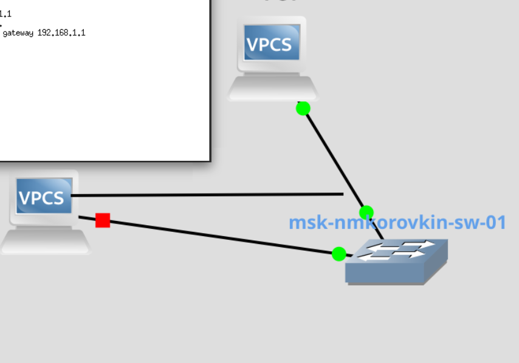
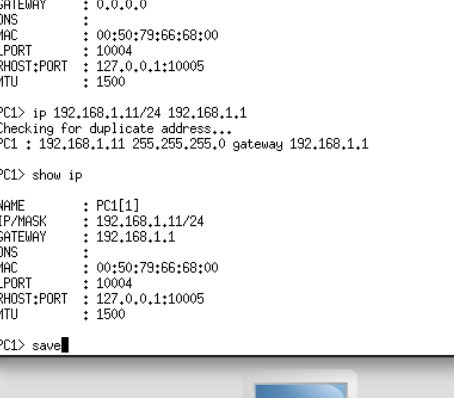
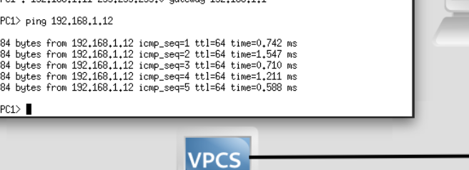
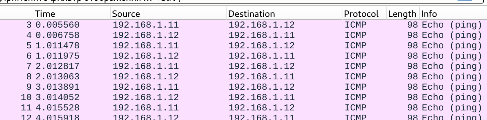
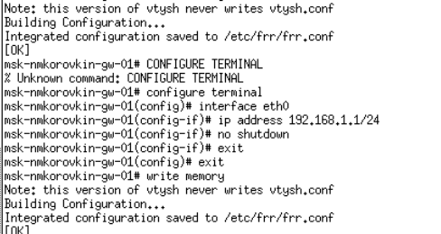
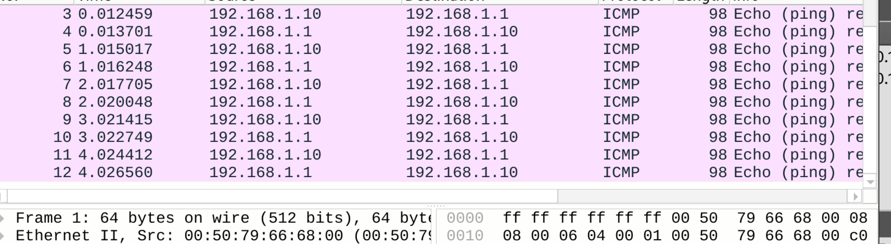

---
## Front matter
lang: ru-RU
title: Отчёт по выполнению лабораторной работы №2
subtitle: Работа с группами
author:
  - Коровкин Н. М.
institute:
  - Российский университет дружбы народов, Москва, Россия
date: 16 феврался 2026

## i18n babel
babel-lang: russian
babel-otherlangs: english

## Formatting pdf
toc: false
toc-title: Содержание
slide_level: 2
aspectratio: 169
section-titles: true
theme: metropolis
header-includes:
 - \metroset{progressbar=frametitle,sectionpage=progressbar,numbering=fraction}
 - '\makeatletter'
 - '\beamer@ignorenonframefalse'
 - '\makeatother'
 
## Fonts
mainfont: PT Serif
romanfont: PT Serif
sansfont: PT Sans
monofont: PT Mono
mainfontoptions: Ligatures=TeX
romanfontoptions: Ligatures=TeX
sansfontoptions: Ligatures=TeX,Scale=MatchLowercase
monofontoptions: Scale=MatchLowercase,Scale=0.9
---

# Информация

## Докладчик

:::::::::::::: {.columns align=center}
::: {.column width="70%"}

  * Коровкин Никита Михайлович
  * Студент
  * Российский университет дружбы народов
  * [1132246835@pfur.ru](mailto:1132246835@pfur.ru)

:::
::: {.column width="30%"}

:::
::::::::::::::

## Цель работы

Построение простейших моделей сети на базе коммутатора и маршрутизаторов FRR и VyOS в GNS3, анализ трафика посредством Wireshark.

## Задание

1. Построить в GNS3 топологию сети, состоящей из коммутатора Ethernet и двух
оконечных устройств (персональных компьютеров).
2. Задать оконечным устройствам IP-адреса в сети 192.168.1.0/24. Проверить
связь.

## Выполнение лабораторной работы

Cперва В GNS3 была создана топология, состоящая из двух виртуальных персональных компьютеров VPCS и Ethernet-коммутатора.(рис. [-@fig:001]).

{#fig:01 width=70%}

## Выполнение лабораторной работы

Затем у первого компьютера назначил нужный айпи(рис. [-@fig:002]).

{#fig:02 width=70%}

## Выполнение лабораторной работы

То же самое делаем со вторым(рис. [-@fig:003]).

{#fig:03 width=70%}

## Выполнение лабораторной работы

Пингуем компьютер 1 со второго(рис. [-@fig:004]).

{#fig:04 width=70%}

## Выполнение лабораторной работы

смотрим пакеты в уайршарк (рис. [-@fig:005]).

{#fig:05 width=70%}

## Выполнение лабораторной работы

Создаем топологию два с фрр и настраиваем(рис. [-@fig:007]).

{#fig:07 width=70%}

## Выполнение лабораторной работы

Настраиваем (рис. [-@fig:008]).

{#fig:08 width=70%}

## Выполнение лабораторной работы

Пингуем и ловим трафик (рис. [-@fig:010]).

{#fig:10 width=70%}

топология 3 (рис. [-@fig:011]).

## Выполнение лабораторной работы

{#fig:11 width=70%}

## Выполнение лабораторной работы

Смотрим трафик после настройки(рис. [-@fig:006]).

{#fig:06 width=70%}

## Выводы

В этой работе были освоены навыки работы с маршрутизатором и основными компонентами

## Список литературы{.unnumbered}

::: {#refs}
:::
