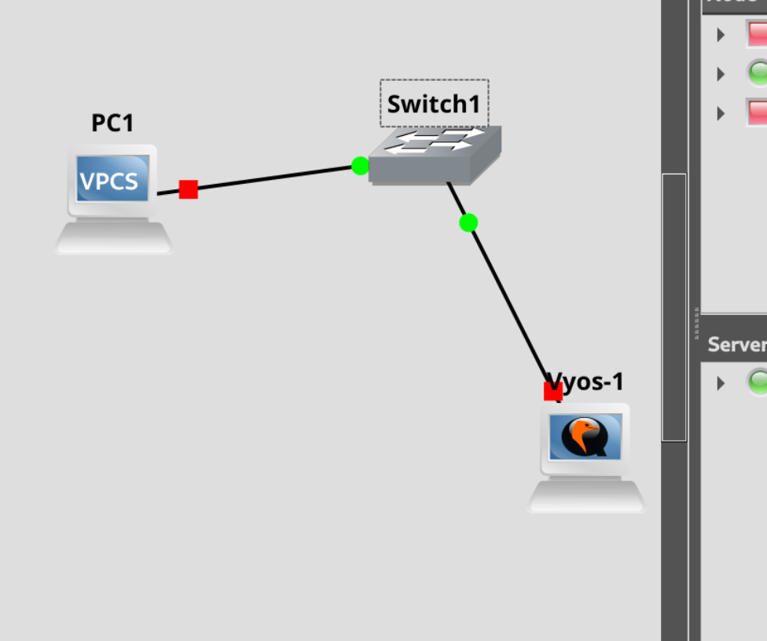

---
## Front matter
title: "Лабораторная работа №2"
subtitle: "Отчёт"
author: "Коровкин Никита Михайлович"

## Generic otions
lang: ru-RU
toc-title: "Содержание"

## Bibliography
bibliography: bib/cite.bib
csl: pandoc/csl/gost-r-7-0-5-2008-numeric.csl

## Pdf output format
toc: true # Table of contents
toc-depth: 2
lof: true # List of figures
lot: true # List of tables
fontsize: 12pt
linestretch: 1.5
papersize: a4
documentclass: scrreprt
## I18n polyglossia
polyglossia-lang:
  name: russian
  options:
	- spelling=modern
	- babelshorthands=true
polyglossia-otherlangs:
  name: english
## I18n babel
babel-lang: russian
babel-otherlangs: english
## Fonts
mainfont: PT Serif
romanfont: PT Serif
sansfont: PT Sans
monofont: PT Mono
mainfontoptions: Ligatures=TeX
romanfontoptions: Ligatures=TeX
sansfontoptions: Ligatures=TeX,Scale=MatchLowercase
monofontoptions: Scale=MatchLowercase,Scale=0.9
## Biblatex
biblatex: true
biblio-style: "gost-numeric"
biblatexoptions:
  - parentracker=true
  - backend=biber
  - hyperref=auto
  - language=auto
  - autolang=other*
  - citestyle=gost-numeric
## Pandoc-crossref LaTeX customization
figureTitle: "Рис."
tableTitle: "Таблица"
listingTitle: "Листинг"
lofTitle: "Список иллюстраций"
lotTitle: "Список таблиц"
lolTitle: "Листинги"
## Misc options
indent: true
header-includes:
  - \usepackage{indentfirst}
  - \usepackage{float} # keep figures where there are in the text
  - \floatplacement{figure}{H} # keep figures where there are in the text
---

# Цель работы

Построение простейших моделей сети на базе коммутатора и маршрутизаторов FRR и VyOS в GNS3, анализ трафика посредством Wireshark.

# Задание

1. Построить в GNS3 топологию сети, состоящей из коммутатора Ethernet и двух
оконечных устройств (персональных компьютеров).
2. Задать оконечным устройствам IP-адреса в сети 192.168.1.0/24. Проверить
связь.

# Выполнение лабораторной работы

Cперва В GNS3 была создана топология, состоящая из двух виртуальных персональных компьютеров VPCS и Ethernet-коммутатора.(рис. [-@fig:001]).

{#fig:01 width=70%}

Затем у первого компьютера назначил нужный айпи(рис. [-@fig:002]).

{#fig:02 width=70%}

То же самое делаем со вторым(рис. [-@fig:003]).

{#fig:03 width=70%}

Пингуем компьютер 1 со второго(рис. [-@fig:004]).

{#fig:04 width=70%}

смотрим пакеты в уайршарк (рис. [-@fig:005]).

{#fig:05 width=70%}

Создаем топологию два с фрр и настраиваем(рис. [-@fig:007]).

{#fig:07 width=70%}

Настраиваем (рис. [-@fig:008]).

{#fig:08 width=70%}

Пингуем и ловим трафик (рис. [-@fig:010]).

{#fig:10 width=70%}

топология 3 (рис. [-@fig:011]).

{#fig:11 width=70%}

Смотрим трафик после настройки(рис. [-@fig:006]).

{#fig:06 width=70%}

# Выводы

В этой работе были освоены навыки работы с маршрутизатором и основными компонентами

# Список литературы{.unnumbered}

::: {#refs}
:::
