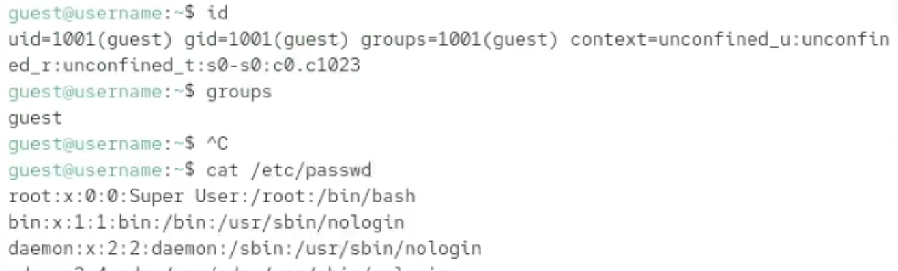
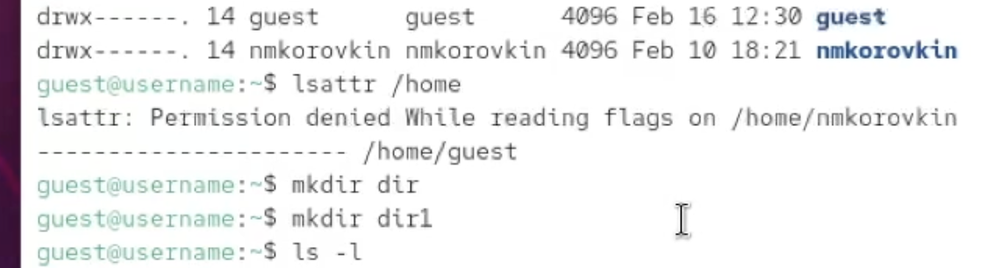
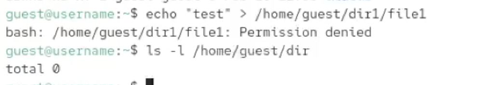

---
## Front matter
title: "Лабораторная работа №2"
subtitle: "Отчёт"
author: "Коровкин Никита Михайлович"

## Generic otions
lang: ru-RU
toc-title: "Содержание"

## Bibliography
bibliography: bib/cite.bib
csl: pandoc/csl/gost-r-7-0-5-2008-numeric.csl

## Pdf output format
toc: true # Table of contents
toc-depth: 2
lof: true # List of figures
lot: true # List of tables
fontsize: 12pt
linestretch: 1.5
papersize: a4
documentclass: scrreprt
## I18n polyglossia
polyglossia-lang:
  name: russian
  options:
	- spelling=modern
	- babelshorthands=true
polyglossia-otherlangs:
  name: english
## I18n babel
babel-lang: russian
babel-otherlangs: english
## Fonts
mainfont: PT Serif
romanfont: PT Serif
sansfont: PT Sans
monofont: PT Mono
mainfontoptions: Ligatures=TeX
romanfontoptions: Ligatures=TeX
sansfontoptions: Ligatures=TeX,Scale=MatchLowercase
monofontoptions: Scale=MatchLowercase,Scale=0.9
## Biblatex
biblatex: true
biblio-style: "gost-numeric"
biblatexoptions:
  - parentracker=true
  - backend=biber
  - hyperref=auto
  - language=auto
  - autolang=other*
  - citestyle=gost-numeric
## Pandoc-crossref LaTeX customization
figureTitle: "Рис."
tableTitle: "Таблица"
listingTitle: "Листинг"
lofTitle: "Список иллюстраций"
lotTitle: "Список таблиц"
lolTitle: "Листинги"
## Misc options
indent: true
header-includes:
  - \usepackage{indentfirst}
  - \usepackage{float} # keep figures where there are in the text
  - \floatplacement{figure}{H} # keep figures where there are in the text
---

# Цель работы

Получение практических навыков работы в консоли с атрибутами файлов, закрепление теоретических основ дискреционного разграничения доступа в современных системах с открытым кодом на базе ОС Linux.

# Задание

1. Создание учетной записи пользователя `guest`.
2. Анализ атрибутов и параметров учетной записи (UID, GID).
3. Исследование прав доступа к директориям в `/home`.
4. Практическое изучение влияния прав доступа на возможность создания файлов и работу с каталогами.

# Выполнение лабораторной работы

Первым делом, используя учетную запись администратора, мы создаем нового пользователя `guest` и устанавливаем для него пароль. Это необходимо для дальнейшего тестирования прав доступа от лица обычного пользователя (рис. [-@fig:001]).

{#fig:01 width=70%}

После создания учетной записи входим в систему под именем `guest`. С помощью команд `pwd` и `whoami` подтверждаем успешный вход и проверяем текущую директорию. Как правило, при входе терминал сразу открывает домашний каталог пользователя (рис. [-@fig:002]).

{#fig:02 width=70%}

Для более детального анализа используем команду `id`. Она позволяет увидеть уникальный идентификатор пользователя (uid) и его основной группы (gid). Сравниваем эти данные с выводом команды `groups`, чтобы убедиться в их идентичности (рис. [-@fig:003]).

{#fig:03 width=70%}

Далее просматриваем системный файл `/etc/passwd`. С помощью фильтра `grep` находим строку, относящуюся к нашему пользователю. Убеждаемся, что uid и gid в файле совпадают с теми, что мы получили ранее через команду `id` (рис. [-@fig:004]).

{#fig:04 width=70%}

Переходим к изучению структуры `/home`. Команда `ls -l /home/` позволяет увидеть список домашних папок всех пользователей и установленные на них права. Обращаем внимание, есть ли у нас права на чтение содержимого чужих директорий (рис. [-@fig:005]).

{#fig:05 width=70%}

Проверяем наличие расширенных атрибутов с помощью `lsattr`. В большинстве стандартных конфигураций на домашних папках отсутствуют специфические флаги, но проверка важна для понимания механизмов безопасности Linux (рис. [-@fig:006]).

{#fig:06 width=70%}

Создаем в домашней директории папку `dir1` и проверяем её стандартные права доступа. По умолчанию Linux выставляет права, позволяющие владельцу полный доступ (чтение, запись, исполнение) (рис. [-@fig:007]).

{#fig:07 width=70%}

Завершающий этап эксперимента: снимаем все права с папки `dir1` командой `chmod 000`. После этого пытаемся создать файл внутри этой папки. Система ожидаемо выдает ошибку «Permission denied», так как у пользователя больше нет права на запись и выполнение (вход) в этот каталог (рис. [-@fig:008]).

При попытке создания файла `file1` в директории `dir1` с правами `000` был получен отказ. Это связано с тем, что для создания файла в каталоге пользователю необходимы права **write (w)** для изменения содержимого каталога и **execute (x)** для доступа к самому каталогу (перехода в него). Поскольку мы сняли все атрибуты, операционная система заблокировала операцию на уровне ядра. Файл не был создан, что подтверждается проверкой через `ls -l`.

# Выводы

В ходе лабораторной работы были освоены базовые команды управления пользователями и анализа прав доступа. 
# Список литературы{.unnumbered}

::: {#refs}
:::
