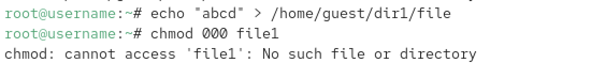

---
## Front matter
lang: ru-RU
title: Отчёт по выполнению лабораторной работы №4
subtitle: Работа с группами
author:
  - Коровкин Н. М.
institute:
  - Российский университет дружбы народов, Москва, Россия
date: 30 феврался 2026

## i18n babel
babel-lang: russian
babel-otherlangs: english

## Formatting pdf
toc: false
toc-title: Содержание
slide_level: 2
aspectratio: 169
section-titles: true
theme: metropolis
header-includes:
 - \metroset{progressbar=frametitle,sectionpage=progressbar,numbering=fraction}
 - '\makeatletter'
 - '\beamer@ignorenonframefalse'
 - '\makeatother'
 
## Fonts
mainfont: PT Serif
romanfont: PT Serif
sansfont: PT Sans
monofont: PT Mono
mainfontoptions: Ligatures=TeX
romanfontoptions: Ligatures=TeX
sansfontoptions: Ligatures=TeX,Scale=MatchLowercase
monofontoptions: Scale=MatchLowercase,Scale=0.9
---

# Информация

## Докладчик

:::::::::::::: {.columns align=center}
::: {.column width="70%"}

  * Коровкин Никита Михайлович
  * Студент
  * Российский университет дружбы народов
  * [1132246835@pfur.ru](mailto:1132246835@pfur.ru)

:::
::: {.column width="30%"}

:::
::::::::::::::

## Цель работы

Получение практических навыков работы в консоли с расширенными атрибутами файлов, изучение механизмов защиты файлов от удаления и редактирования даже со стороны владельца.

## Задание

1. Работа с расширенным атрибутом `a` (append only).
2. Работа с расширенным атрибутом `i` (immutable).
3. Сравнение прав обычного пользователя и суперпользователя при установке атрибутов.
4. Проверка ограничений на удаление, переименование и модификацию файлов с установленными атрибутами.

## Выполнение лабораторной работы

Начинаем с проверки текущих расширенных атрибутов файла `file1` и установки стандартных прав доступа. С помощью `chmod 600` даем владельцу права на чтение и запись, после чего проверяем начальное состояние через `lsattr` 

## Выполнение лабораторной работы

Пробуем установить атрибут `+a` (возможность только дозаписи) от имени обычного пользователя `guest`. Система выдает ошибку, так как изменение расширенных атрибутов — это привилегированная операция. Переключаемся на root и успешно устанавливаем атрибут 

Возвращаемся к пользователю `guest` и проверяем, видит ли он изменения. Команда `lsattr` подтверждает наличие флага `a` в строке атрибутов файла 

## Выполнение лабораторной работы

Проверяем работу атрибута «только дозапись». Попытка дописать строку через оператор `>>` проходит успешно, и текст сохраняется. Это единственный разрешенный метод изменения содержимого файла при данном флаге 

Пытаемся нарушить правила: пробуем перезаписать файл через `>`, удалить его или переименовать. Несмотря на то что `guest` является владельцем, система блокирует эти действия, защищая целостность данных (рис. [-@fig:003]).

{#fig:03 width=70%}

## Выполнение лабораторной работы

Снимаем атрибут `a` под root-правами. Теперь, когда защита снята, возвращаемся к пользователю `guest` и убеждаемся, что файл снова можно свободно переименовывать, изменять и удалять (рис. [-@fig:004]).

{#fig:04 width=70%}

## Выполнение лабораторной работы

Повторяем цикл действий с атрибутом `i` (immutable). Этот флаг еще строже: в отличие от `a`, он запрещает даже дозапись. Файл становится абсолютно неизменяемым «камнем», который нельзя ни тронуть, ни дополнить до снятия флага суперпользователем 

## Выводы

В ходе работы было установлено, что расширенные атрибуты `a` и `i` обеспечивают уровень защиты, недоступный обычным правам `rwx`. Атрибут `a` полезен для лог-файлов (защита от затирания истории), а `i` — для критически важных конфигов.

## Список литературы{.unnumbered}

::: {#refs}
:::
