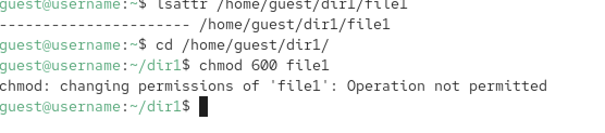
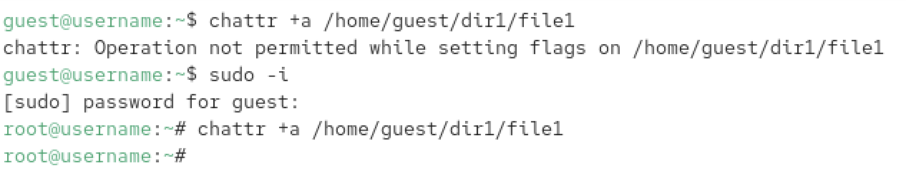
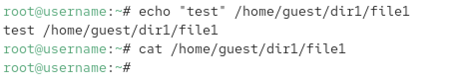

---
## Front matter
title: "Лабораторная работа №4"
subtitle: "Отчёт"
author: "Коровкин Никита Михайлович"

## Generic otions
lang: ru-RU
toc-title: "Содержание"

## Bibliography
bibliography: bib/cite.bib
csl: pandoc/csl/gost-r-7-0-5-2008-numeric.csl

## Pdf output format
toc: true # Table of contents
toc-depth: 2
lof: true # List of figures
lot: true # List of tables
fontsize: 12pt
linestretch: 1.5
papersize: a4
documentclass: scrreprt
## I18n polyglossia
polyglossia-lang:
  name: russian
  options:
	- spelling=modern
	- babelshorthands=true
polyglossia-otherlangs:
  name: english
## I18n babel
babel-lang: russian
babel-otherlangs: english
## Fonts
mainfont: PT Serif
romanfont: PT Serif
sansfont: PT Sans
monofont: PT Mono
mainfontoptions: Ligatures=TeX
romanfontoptions: Ligatures=TeX
sansfontoptions: Ligatures=TeX,Scale=MatchLowercase
monofontoptions: Scale=MatchLowercase,Scale=0.9
## Biblatex
biblatex: true
biblio-style: "gost-numeric"
biblatexoptions:
  - parentracker=true
  - backend=biber
  - hyperref=auto
  - language=auto
  - autolang=other*
  - citestyle=gost-numeric
## Pandoc-crossref LaTeX customization
figureTitle: "Рис."
tableTitle: "Таблица"
listingTitle: "Листинг"
lofTitle: "Список иллюстраций"
lotTitle: "Список таблиц"
lolTitle: "Листинги"
## Misc options
indent: true
header-includes:
  - \usepackage{indentfirst}
  - \usepackage{float} # keep figures where there are in the text
  - \floatplacement{figure}{H} # keep figures where there are in the text
---

# Цель работы

Получение практических навыков работы в консоли с расширенными атрибутами файлов, изучение механизмов защиты файлов от удаления и редактирования даже со стороны владельца.

# Задание

1. Работа с расширенным атрибутом `a` (append only).
2. Работа с расширенным атрибутом `i` (immutable).
3. Сравнение прав обычного пользователя и суперпользователя при установке атрибутов.
4. Проверка ограничений на удаление, переименование и модификацию файлов с установленными атрибутами.

# Выполнение лабораторной работы

Начинаем с проверки текущих расширенных атрибутов файла `file1` и установки стандартных прав доступа. С помощью `chmod 600` даем владельцу права на чтение и запись, после чего проверяем начальное состояние через `lsattr` (рис. [-@fig:001]).

{#fig:01 width=70%}

Пробуем установить атрибут `+a` (возможность только дозаписи) от имени обычного пользователя `guest`. Система выдает ошибку, так как изменение расширенных атрибутов — это привилегированная операция. Переключаемся на root и успешно устанавливаем атрибут 

Возвращаемся к пользователю `guest` и проверяем, видит ли он изменения. Команда `lsattr` подтверждает наличие флага `a` в строке атрибутов файла (рис. [-@fig:002]).

{#fig:02 width=70%}

Проверяем работу атрибута «только дозапись». Попытка дописать строку через оператор `>>` проходит успешно, и текст сохраняется. Это единственный разрешенный метод изменения содержимого файла при данном флаге 

Пытаемся нарушить правила: пробуем перезаписать файл через `>`, удалить его или переименовать. Несмотря на то что `guest` является владельцем, система блокирует эти действия, защищая целостность данных (рис. [-@fig:003]).

{#fig:03 width=70%}

Снимаем атрибут `a` под root-правами. Теперь, когда защита снята, возвращаемся к пользователю `guest` и убеждаемся, что файл снова можно свободно переименовывать, изменять и удалять (рис. [-@fig:004]).

{#fig:04 width=70%}

Повторяем цикл действий с атрибутом `i` (immutable). Этот флаг еще строже: в отличие от `a`, он запрещает даже дозапись. Файл становится абсолютно неизменяемым «камнем», который нельзя ни тронуть, ни дополнить до снятия флага суперпользователем 

# Выводы

В ходе работы было установлено, что расширенные атрибуты `a` и `i` обеспечивают уровень защиты, недоступный обычным правам `rwx`. Атрибут `a` полезен для лог-файлов (защита от затирания истории), а `i` — для критически важных конфигов. Главное наблюдение: даже владелец файла не может управлять этими атрибутами без прав суперпользователя.

# Список литературы{.unnumbered}

::: {#refs}
:::
