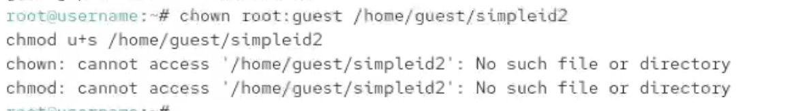

---
## Front matter
lang: ru-RU
title: Отчёт по выполнению лабораторной работы №5
subtitle: Работа с группами
author:
  - Коровкин Н. М.
institute:
  - Российский университет дружбы народов, Москва, Россия
date: 30 феврался 2026

## i18n babel
babel-lang: russian
babel-otherlangs: english

## Formatting pdf
toc: false
toc-title: Содержание
slide_level: 2
aspectratio: 169
section-titles: true
theme: metropolis
header-includes:
 - \metroset{progressbar=frametitle,sectionpage=progressbar,numbering=fraction}
 - '\makeatletter'
 - '\beamer@ignorenonframefalse'
 - '\makeatother'
 
## Fonts
mainfont: PT Serif
romanfont: PT Serif
sansfont: PT Sans
monofont: PT Mono
mainfontoptions: Ligatures=TeX
romanfontoptions: Ligatures=TeX
sansfontoptions: Ligatures=TeX,Scale=MatchLowercase
monofontoptions: Scale=MatchLowercase,Scale=0.9
---

# Информация

## Докладчик

:::::::::::::: {.columns align=center}
::: {.column width="70%"}

  * Коровкин Никита Михайлович
  * Студент
  * Российский университет дружбы народов
  * [1132246835@pfur.ru](mailto:1132246835@pfur.ru)

:::
::: {.column width="30%"}

:::
::::::::::::::

## Цель работы

Изучение механизмов изменения идентификаторов, применения SetUID- и Sticky-битов. Получение практических навыков работы в консоли с дополнительными атрибутами. Рассмотрение работы механизма смены идентификатора процессов пользователей, а также влияние бита Sticky на запись и удаление файлов.

## Выполнение лабораторной работы

Cоздадим файл с кодом (рис. [-@fig:001]).

{#fig:01 width=70%}

## Выполнение лабораторной работы

И запишем туда следующий код (рис. [-@fig:002]).

{#fig:002}

## Выполнение лабораторной работы

Скомпилируем программу, запустим её. Как видим, она практически идентична команде id (рис. [-@fig:003]).

{#fig:003}

## Выполнение лабораторной работы

Создадим новую программу (рис. [-@fig:004]).

{#fig:004}

## Выполнение лабораторной работы

также скомпилируем её и запустим (рис. [-@fig:005]).

{#fig:005}

## Выполнение лабораторной работы

Создадим новый файл, и напишем туда код (рис. [-@fig:006]).

{#fig:006}

## Выполнение лабораторной работы

Скомпилируем программу и попробуем открыть исходный код (рис. [-@fig:007]).

{#fig:007}

## Выполнение лабораторной работы

Теперь сменим для исполняемого файла владельца

Попробуем с помощью программы прочитать исходный код, и это успешно получается 

Прочтем файл /etc/shadow 

Теперь посмотрим, есть ли на папке /tmp stickybit. После этого создадим отлица пользователя guest файл.

От лица другого пользователя пытаемся дозаписать что-то в файл, записать что-то в файл и удалить этот файл. Все операции неуспешны 

## Выполнение лабораторной работы

Снимем Stickybit и попробуем повторить эти операции. Теперь получилось удалить файл (рис. [-@fig:008]).

{#fig:008}

## Выводы

В результате выполнения лабораторной работы были получены знания механизмов изменения идентификаторов, применения SetUID- и Sticky-битов

## Список литературы{.unnumbered}

::: {#refs}
:::
