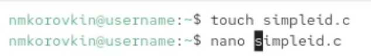
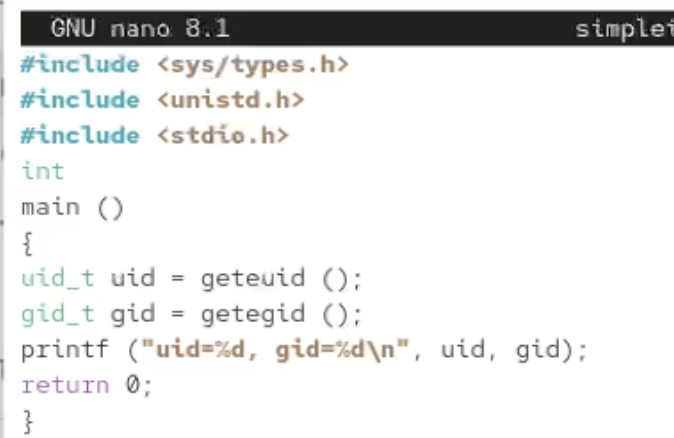
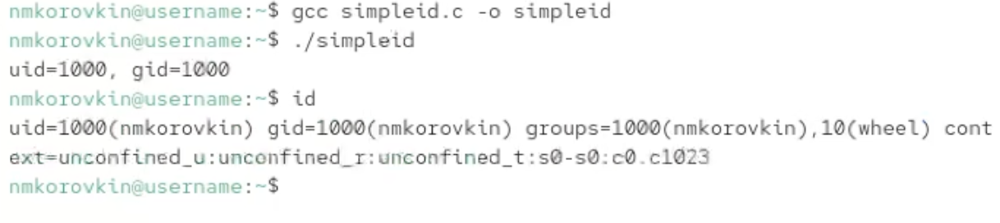
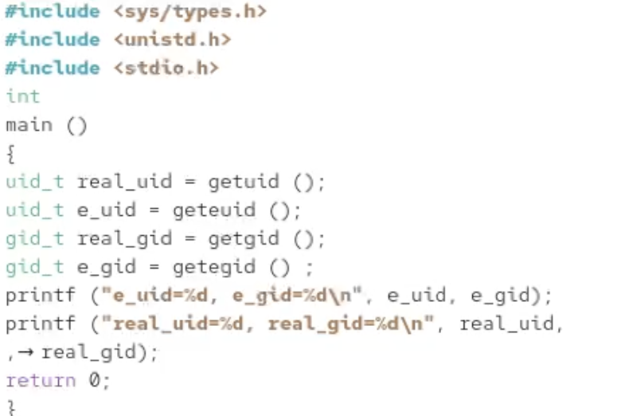
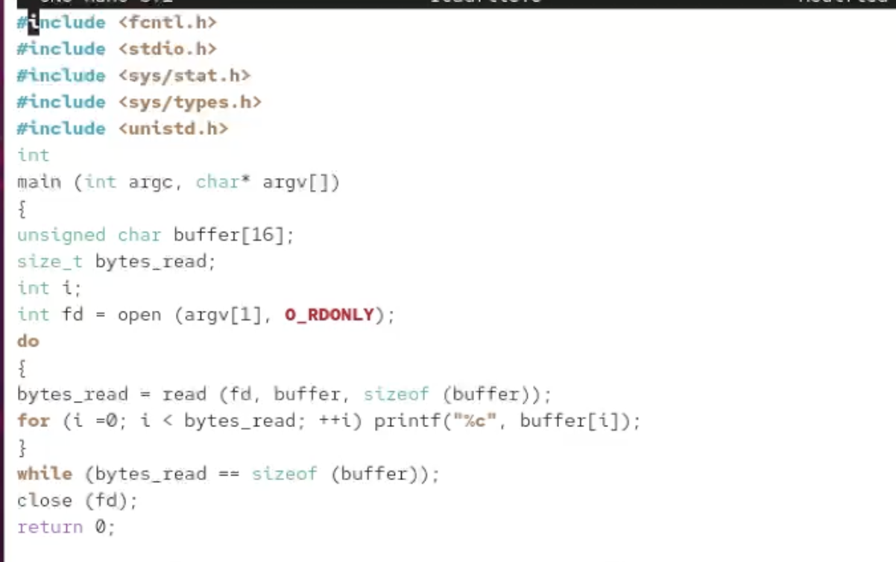

---
## Front matter
title: "Лабораторная работа №5"
subtitle: "Отчёт"
author: "Коровкин Никита Михайлович"

## Generic otions
lang: ru-RU
toc-title: "Содержание"

## Bibliography
bibliography: bib/cite.bib
csl: pandoc/csl/gost-r-7-0-5-2008-numeric.csl

## Pdf output format
toc: true # Table of contents
toc-depth: 2
lof: true # List of figures
lot: true # List of tables
fontsize: 12pt
linestretch: 1.5
papersize: a4
documentclass: scrreprt
## I18n polyglossia
polyglossia-lang:
  name: russian
  options:
	- spelling=modern
	- babelshorthands=true
polyglossia-otherlangs:
  name: english
## I18n babel
babel-lang: russian
babel-otherlangs: english
## Fonts
mainfont: PT Serif
romanfont: PT Serif
sansfont: PT Sans
monofont: PT Mono
mainfontoptions: Ligatures=TeX
romanfontoptions: Ligatures=TeX
sansfontoptions: Ligatures=TeX,Scale=MatchLowercase
monofontoptions: Scale=MatchLowercase,Scale=0.9
## Biblatex
biblatex: true
biblio-style: "gost-numeric"
biblatexoptions:
  - parentracker=true
  - backend=biber
  - hyperref=auto
  - language=auto
  - autolang=other*
  - citestyle=gost-numeric
## Pandoc-crossref LaTeX customization
figureTitle: "Рис."
tableTitle: "Таблица"
listingTitle: "Листинг"
lofTitle: "Список иллюстраций"
lotTitle: "Список таблиц"
lolTitle: "Листинги"
## Misc options
indent: true
header-includes:
  - \usepackage{indentfirst}
  - \usepackage{float} # keep figures where there are in the text
  - \floatplacement{figure}{H} # keep figures where there are in the text
---

# Цель работы

Изучение механизмов изменения идентификаторов, применения SetUID- и Sticky-битов. Получение практических навыков работы в консоли с дополнительными атрибутами. Рассмотрение работы механизма смены идентификатора процессов пользователей, а также влияние бита Sticky на запись и удаление файлов.

# Выполнение лабораторной работы

Cоздадим файл с кодом (рис. [-@fig:001]).

{#fig:01 width=70%}

И запишем туда следующий код (рис. [-@fig:002]).

{#fig:002}

Скомпилируем программу, запустим её. Как видим, она практически идентична команде id (рис. [-@fig:003]).

{#fig:003}

Создадим новую программу (рис. [-@fig:004]).

{#fig:004}

также скомпилируем её и запустим (рис. [-@fig:005]).

{#fig:005}

Создадим новый файл, и напишем туда код (рис. [-@fig:006]).

{#fig:006}

Скомпилируем программу и попробуем открыть исходный код (рис. [-@fig:007]).

{#fig:007}

Теперь сменим для исполняемого файла владельца

Попробуем с помощью программы прочитать исходный код, и это успешно получается 

Прочтем файл /etc/shadow 

Теперь посмотрим, есть ли на папке /tmp stickybit. После этого создадим отлица пользователя guest файл.

От лица другого пользователя пытаемся дозаписать что-то в файл, записать что-то в файл и удалить этот файл. Все операции неуспешны 

Снимем Stickybit и попробуем повторить эти операции. Теперь получилось удалить файл (рис. [-@fig:008]).

{#fig:008}

# Выводы

В результате выполнения лабораторной работы были получены знания механизмов изменения идентификаторов, применения SetUID- и Sticky-битов

# Список литературы{.unnumbered}

::: {#refs}
:::
