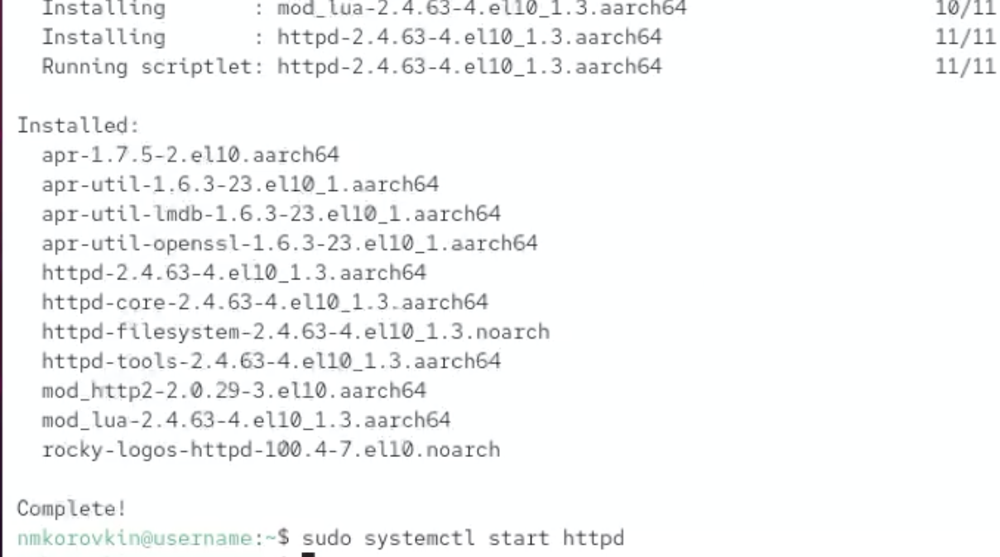
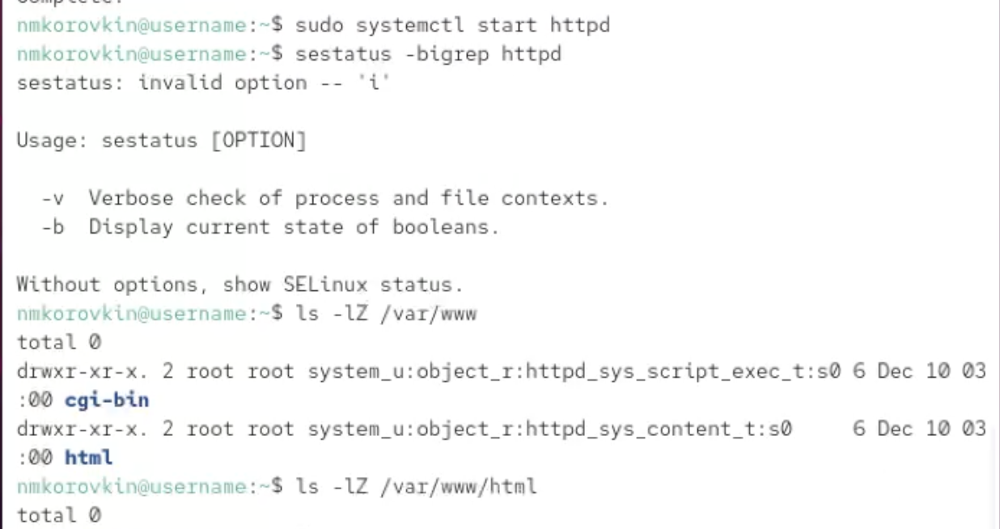
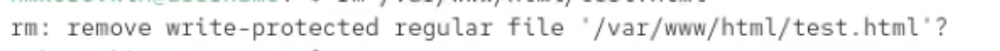

---
## Front matter
lang: ru-RU
title: Отчёт по выполнению лабораторной работы №6
subtitle: Работа с группами
author:
  - Коровкин Н. М.
institute:
  - Российский университет дружбы народов, Москва, Россия
date: 30 феврался 2026

## i18n babel
babel-lang: russian
babel-otherlangs: english

## Formatting pdf
toc: false
toc-title: Содержание
slide_level: 2
aspectratio: 169
section-titles: true
theme: metropolis
header-includes:
 - \metroset{progressbar=frametitle,sectionpage=progressbar,numbering=fraction}
 - '\makeatletter'
 - '\beamer@ignorenonframefalse'
 - '\makeatother'
 
## Fonts
mainfont: PT Serif
romanfont: PT Serif
sansfont: PT Sans
monofont: PT Mono
mainfontoptions: Ligatures=TeX
romanfontoptions: Ligatures=TeX
sansfontoptions: Ligatures=TeX,Scale=MatchLowercase
monofontoptions: Scale=MatchLowercase,Scale=0.9
---

# Информация

## Докладчик

:::::::::::::: {.columns align=center}
::: {.column width="70%"}

  * Коровкин Никита Михайлович
  * Студент
  * Российский университет дружбы народов
  * [1132246835@pfur.ru](mailto:1132246835@pfur.ru)

:::
::: {.column width="30%"}

:::
::::::::::::::

## Цель работы

Развить навыки администрирования ОС Linux. Получить первое практическое знакомство с технологией SELinux.

## Лабораторная работа

Проверим,что SELinux работает в режиме enfording и

посмотрим переключатели SELinux для httpd (рис. [-@fig:001]).

{#fig:001}

## Лабораторная работа

Посмотрим на количество типов, пользователей и ролей с помощью команды seinfo (рис. [-@fig:002]).

{#fig:002}

## Лабораторная работа

Создадим файл /var/www/html/test.html и заполним его одним словом (рис. [-@fig:003]).

{#fig:003}

## Лабораторная работа

При открытии браузера открывается созданная нами страница (рис. [-@fig:004]).

{#fig:004}

## Лабораторная работа

Затем посмотрим на метки в директории /var/www/html/ и попробуем сменить метку созданного нами файла и посмотрим логи.

После смены метки доступ к странице был запрещён (рис. [-@fig:005]).

{#fig:005}

## Лабораторная работа

Перезагрузим службу. После этого мы не сможем зайти на нашу страницу. Об этом также будут писать логи(рис. [-@fig:006]).

{#fig:006}

## Лабораторная работа

Для того, чтобы получилось зайти, досаточно добавить 81 порт в semanage. После Этого вернём всё как было (рис. [-@fig:007]).

{#fig:007}

## Лабораторная работа

При добавленном порте сайт работает, но нам необходимо указать что мы обращаемся именно к этому - 81 порту 

после удаляем порт - что нам не удается и затем удаляем директорию сайта (рис. [-@fig:008]).

{#fig:008}

#№ Выводы

В результате выполнения лабораторной работы нами было получено понимание работы мандатного разграничения доступа

## Список литературы{.unnumbered}

::: {#refs}
:::
