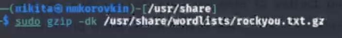
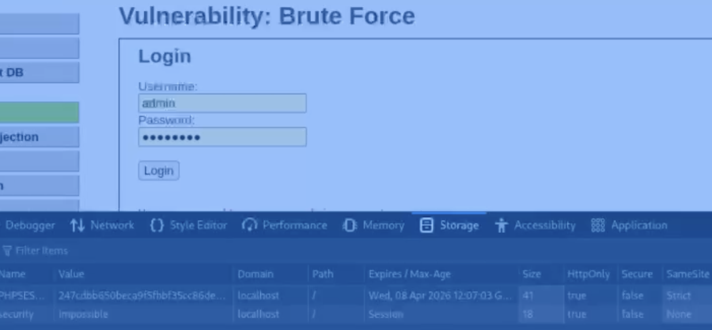
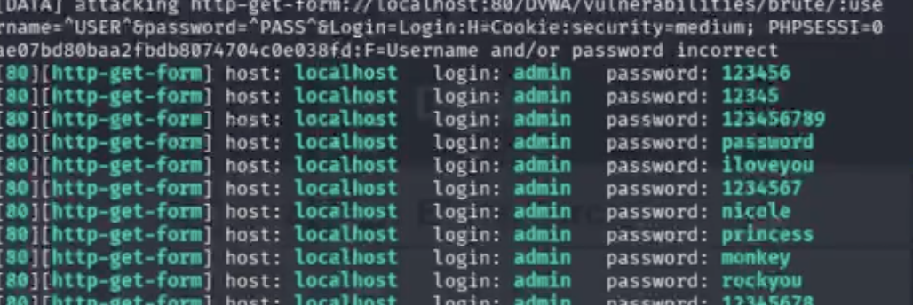
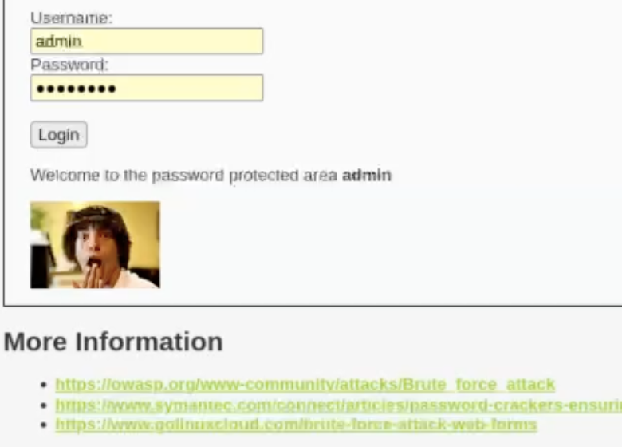

---
## Front matter
lang: ru-RU
title: Индивидуальный проект этап 3
subtitle: Презентация
author:
  - Коровкин Н.М
institute:
  - Российский университет дружбы народов, Москва, Россия
date: 10 марта 2026

## i18n babel
babel-lang: russian
babel-otherlangs: english

## Formatting pdf
toc: false
toc-title: Содержание
slide_level: 2
aspectratio: 169
section-titles: true
theme: metropolis
header-includes:
 - \metroset{progressbar=frametitle,sectionpage=progressbar,numbering=fraction}
 - '\makeatletter'
 - '\beamer@ignorenonframefalse'
 - '\makeatother'
 
## Fonts
mainfont: PT Serif
romanfont: PT Serif
sansfont: PT Sans
monofont: PT Mono
mainfontoptions: Ligatures=TeX
romanfontoptions: Ligatures=TeX
sansfontoptions: Ligatures=TeX,Scale=MatchLowercase
monofontoptions: Scale=MatchLowercase,Scale=0.9
---

# Информация

## Докладчик

:::::::::::::: {.columns align=center}
::: {.column width="70%"}

  * Коровкин Никита Михайлович
  * Студент
  * Российский университет дружбы народов
  * [1132246835@pfur.ru](mailto:1132246835@pfur.ru)

:::
::: {.column width="30%"}

:::
::::::::::::::

## Цель работы

Разобраться в работе Hydra

## Выполнение лабораторной работы

Для начала мы распакуем архив с базой данных паролей (рис. [-@fig:001]).

{#fig:001}

## Запоминаем информацию

Далее сломаем одно из окон авторизации DVWA. Запомним фразу, которая высвечивается при неправильном пароле, а также данные куки снизу (рис. [-@fig:002]).

{#fig:002}

## Использование гидры

После этого воспользуемся гидрой. Укажем ей файл с паролями и адрес ломаемого сайта. Укажем также данные куки и фразу, выводящуюся при неверной авторизации, что будет подсказкой для гидры, что пароль неверный. В результате, получаем пароль (рис. [-@fig:003]).

{#fig:003}

## Ввод пароля

Вводим пароль на сайт (рис. [-@fig:004]).

{#fig:004}

## Выводы

В результате выполнения лабораторной работы были получены навыки работы с hydra

## Список литературы{.unnumbered}

::: {#refs}
:::
